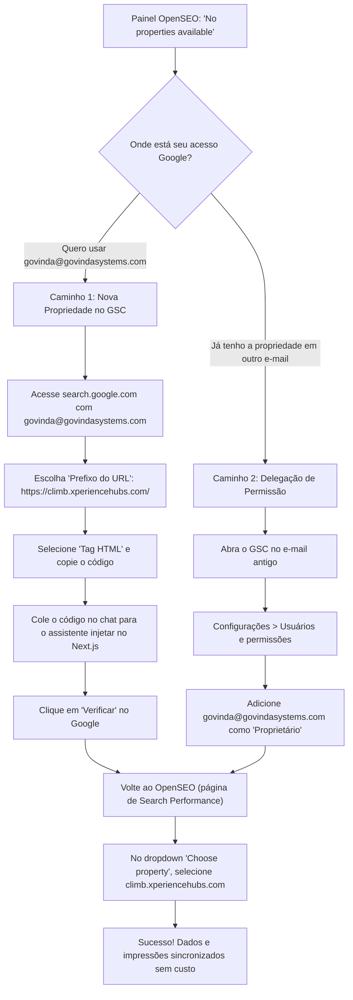

# Tutorial Passo a Passo: Configuração do Google Search Console no OpenSEO

> **Objetivo:** Resolver o aviso _"No properties available"_ no OpenSEO e conectar a propriedade `https://climb.xperiencehubs.com/` à conta `govinda@govindasystems.com` com custo zero.

---

## Fluxo Visual de Configuração



---

## Caminho 1: Criar e Verificar a Propriedade (Recomendado)

Siga estas etapas se você deseja gerenciar tudo pela conta `govinda@govindasystems.com`:

### Passo 1: Abrir o Google Search Console

1. Abra uma nova aba no navegador: [Google Search Console](https://search.google.com/search-console/welcome).
2. Verifique no canto superior direito se você está conectado com `govinda@govindasystems.com`.

### Passo 2: Adicionar a Propriedade

1. No painel de boas-vindas (ou no menu superior esquerdo > **+ Adicionar propriedade**):
2. Você verá duas opções:
   - **Domínio** (à esquerda)
   - **Prefixo do URL** (à direita - **Selecione esta**)
3. No campo **Prefixo do URL**, digite exatamente:
   ```text
   https://climb.xperiencehubs.com/
   ```
4. Clique em **Continuar**.

### Passo 3: Escolher o Método de Verificação por Tag HTML

1. O Google exibirá a janela _"Verificar propriedade"_.
2. Role até a seção **"Outros métodos de verificação"**.
3. Clique em **Tag HTML** (_Adicione uma metatag à página inicial do seu site_).
4. O Google mostrará um código similar a:
   ```html
   <meta name="google-site-verification" content="ABC123xyz_SEU_CODIGO_AQUI" />
   ```
5. Clique no botão **Copiar**.

### Passo 4: Injetar o Código no Next.js (Feito pelo Assistente)

1. Cole a tag copiada aqui no chat do assistente.
2. O assistente injetará o código automaticamente no arquivo `src/app/layout.tsx`:
   ```typescript
   export const metadata: Metadata = {
     // ...
     verification: {
       google: 'ABC123xyz_SEU_CODIGO_AQUI',
     },
   };
   ```
3. O assistente fará o deploy / validação do código.

### Passo 5: Confirmar a Verificação no Google

1. Volte à janela do Google Search Console.
2. Clique no botão azul/verde **Verificar**.
3. Uma mensagem de confirmação verde aparecerá: _"Propriedade verificada"_.
4. Clique em **Ir para a propriedade**.

### Passo 6: Conectar no OpenSEO

1. Acesse o painel do OpenSEO:
   [OpenSEO Search Performance](https://app.openseo.so/p/0e5c4f70-39ed-4b1f-a90f-f46de87b4281/search-performance).
2. No campo **"Choose property"** (onde antes dizia _Select a property..._):
   - Clique no dropdown.
   - A URL `https://climb.xperiencehubs.com/` agora aparecerá disponível!
3. Selecione-a. O status mudará imediatamente de _Not connected_ para _Connected_.

---

## Caminho 2: Delegar Acesso de Outra Conta Google

Se você já possuía o domínio `climb.xperiencehubs.com` verificado em outro e-mail (ex: seu Gmail pessoal ou institucional):

1. Acesse o [Google Search Console](https://search.google.com/search-console) com o e-mail que já possui a propriedade.
2. Selecione a propriedade `https://climb.xperiencehubs.com/` no canto superior esquerdo.
3. No menu lateral esquerdo, clique em **Configurações** (ícone de engrenagem).
4. Clique em **Usuários e permissões**.
5. Clique no botão azul **Adicionar usuário** (canto superior direito).
6. Digite:
   - **E-mail:** `govinda@govindasystems.com`
   - **Permissão:** `Proprietário` (Owner) ou `Total` (Full).
7. Clique em **Adicionar**.
8. Volte ao [OpenSEO](https://app.openseo.so/p/0e5c4f70-39ed-4b1f-a90f-f46de87b4281/search-performance) e recarregue a página (F5 / Cmd+R).
9. A propriedade aparecerá automaticamente no dropdown para você selecionar.

---

## Perguntas Frequentes & Resolução de Problemas

### Por que apareceu "No properties available"?

Porque a autorização OAuth do Google foi concedida com sucesso para o OpenSEO ler seus dados, mas a API do Google Search Console retornou lista vazia de sites associados à conta `govinda@govindasystems.com`.

### Depois de verificar no Google, a lista ainda não atualizou no OpenSEO?

1. Clique em **Remove account** na tela do OpenSEO ao lado de `govinda@govindasystems.com`.
2. Em seguida, clique em **Connect Google Search Console** novamente.
3. Isso força a renovação do token OAuth da API do Google, carregando a lista atualizada de propriedades em segundos.
