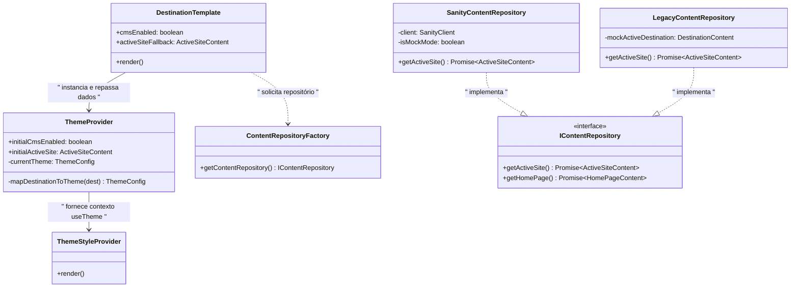
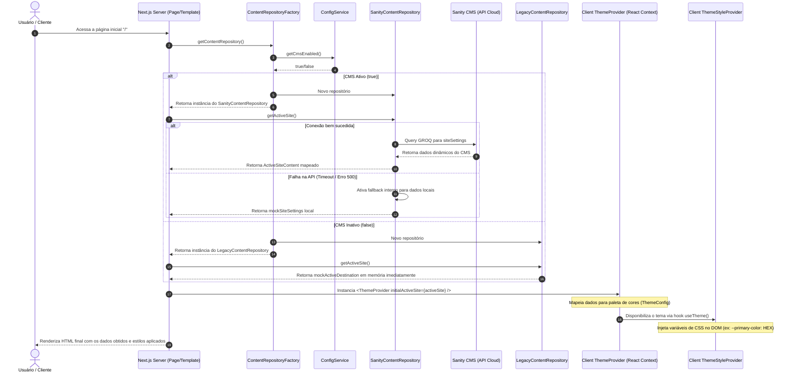

# Arquitetura do XperienceClimb

## Visão Geral

O **XperienceClimb** é uma aplicação web full-stack desenvolvida em **Next.js 15** que oferece experiências de escalada na Floresta Nacional de Ipanema. A aplicação utiliza uma arquitetura em camadas baseada em **Clean Architecture** e **Domain-Driven Design (DDD)**.

### Tecnologias Principais

- **Framework**: Next.js 15 (App Router)
- **Linguagem**: TypeScript
- **Estilização**: Tailwind CSS
- **Estado**: Zustand
- **Autenticação**: Privy (Web3 + Social)
- **Pagamentos**: Múltiplos (Mercado Pago, PIX, Bitcoin, USDT, GitHub Sponsors)
- **Comunicação**: WhatsApp API
- **Testes**: Jest + React Testing Library + Cucumber (BDD)
- **Deployment**: Vercel
- **Arquitetura**: Clean Architecture + DDD

---

## Estrutura de Diretórios

```
XperienceClimb/
├── src/
│   ├── app/                    # Next.js App Router
│   │   ├── api/               # API Routes
│   │   ├── checkout/          # Páginas de checkout
│   │   ├── layout.tsx         # Layout raiz
│   │   └── page.tsx           # Página inicial
│   ├── components/            # Componentes React
│   │   ├── auth/              # Autenticação (Privy)
│   │   ├── cart/              # Carrinho de compras
│   │   ├── checkout/          # Sistema de checkout multi-step
│   │   ├── layout/            # Layout components
│   │   ├── providers/         # Context providers
│   │   ├── sections/          # Seções da página
│   │   ├── theme/             # Sistema de temas
│   │   └── ui/                # Componentes de UI
│   ├── core/                  # Domain Layer (Clean Architecture)
│   │   ├── entities/          # Entidades de domínio
│   │   ├── repositories/      # Interfaces de repositórios
│   │   ├── services/          # Interfaces de serviços
│   │   └── use-cases/         # Casos de uso
│   ├── hooks/                 # Custom hooks
│   ├── infrastructure/        # Infrastructure Layer
│   │   ├── repositories/      # Implementações de repositórios
│   │   └── services/          # Implementações de serviços
│   ├── lib/                   # Utilities e configurações
│   ├── store/                 # Estado global (Zustand)
│   ├── styles/                # Estilos globais
│   ├── tests/                 # Testes BDD (Cucumber)
│   ├── themes/                # Sistema de temas
│   └── types/                 # Definições de tipos
├── public/                    # Assets estáticos
├── scripts/                   # Scripts utilitários
├── __tests__/                 # Testes de unidade e integração
├── jest.config.js             # Configuração Jest
└── cucumber.config.js         # Configuração Cucumber (BDD)
```

---

## Arquitetura em Camadas

### 1. **Presentation Layer** (Interface do Usuário)

#### **App Router (src/app/)**

- **layout.tsx**: Layout raiz com providers e metadados
- **page.tsx**: Página inicial com todas as seções
- **api/**: Endpoints da API (packages, webhooks)
- **checkout/**: Páginas de sucesso/erro do pagamento

#### **Components (src/components/)**

##### **Auth Components**

- `AuthGuard`: Proteção de rotas autenticadas
- `LoginButton`: Botão de login/logout

##### **Cart Components**

- `CartButton`: Botão flutuante do carrinho
- `CartModal`: Modal com itens do carrinho
- `CheckoutForm`: Formulário de finalização (legacy)

##### **Checkout Components**

- `CheckoutFormNew`: Sistema de checkout em 5 etapas
- `PaymentMethodSelector`: Seleção de método de pagamento
- `CouponInput`: Sistema de cupons de desconto
- `GitHubPaymentModal`: Modal para pagamento via GitHub Sponsors

##### **Layout Components**

- `Navigation`: Barra de navegação principal

##### **Section Components**

- `HeroSection`: Seção principal com CTA
- `AboutSection`: Sobre a experiência de escalada
- `PackagesSection`: Pacotes disponíveis (dados da API)
- `GallerySection`: Galeria de imagens com filtros
- `SafetySection`: Informações de segurança
- `LocationSection`: Localização e mapa
- `TestimonialsSection`: Depoimentos dos clientes
- `CommunitySection`: Comunidade e engajamento
- `Footer`: Rodapé com informações de contato

##### **Theme Components**

- `ThemeSelector`: Seletor de temas/destinos
- `ThemeProvider`: Provider do sistema de temas

##### **UI Components**

- `Button`: Componente de botão reutilizável
- `Card`: Componente de card reutilizável

##### **Providers**

- `PrivyProvider`: Provider de autenticação

### 2. **Application Layer** (Casos de Uso)

#### **Use Cases (src/core/use-cases/)**

##### **Auth**

- `LoginUser`: Autenticação de usuário
- `GetUserProfile`: Obter perfil do usuário

##### **Packages**

- `GetAllPackages`: Buscar todos os pacotes
- `GetPackageAvailability`: Verificar disponibilidade

##### **Orders**

- `CreateOrder`: Criar pedido com múltiplos métodos de pagamento

##### **Payments**

- `ProcessPixPayment`: Processar pagamentos PIX
- `ProcessCryptoPayment`: Processar pagamentos em criptomoeda
- `ProcessGitHubPayment`: Processar pagamentos via GitHub Sponsors

##### **Coupons**

- `ValidateCoupon`: Validar cupons de desconto
- `ApplyDiscount`: Aplicar descontos com regras de negócio

##### **Tours**

- `CreateTour`: Criar novos tours
- `GetToursByTheme`: Buscar tours por tema
- `ValidateTourData`: Validar dados de tour

##### **Cart**

- Gerenciado pelo Zustand store sem casos de uso específicos

### 3. **Domain Layer** (Regras de Negócio)

#### **Entities (src/core/entities/)**

##### **User**

```typescript
interface User {
  id: string;
  email: string;
  name?: string;
  avatar?: string;
  createdAt: Date;
  isAdmin?: boolean;
}
```

##### **Package**

```typescript
interface Package {
  id: string;
  name: string;
  price: Money;
  description: string;
  features: string[];
  availability: PackageAvailability;
  rules: BookingRules;
}
```

##### **Order**

```typescript
interface Order {
  id: string;
  userId: string;
  items: CartItem[];
  total: number;
  discount?: DiscountInfo;
  status: 'pending' | 'paid' | 'cancelled' | 'refunded';
  paymentMethod: 'card' | 'pix' | 'bitcoin' | 'usdt' | 'github' | 'whatsapp';
  paymentId?: string;
  mercadoPagoId?: string;
  createdAt: Date;
  updatedAt: Date;
}
```

##### **Coupon**

```typescript
interface Coupon {
  id: string;
  code: string;
  type: 'percentage' | 'fixed';
  value: number;
  minOrderValue?: number;
  maxDiscount?: number;
  validFrom: Date;
  validUntil: Date;
  usageLimit?: number;
  usedCount: number;
  allowedPaymentMethods?: PaymentMethod[];
  isActive: boolean;
}
```

##### **CryptoPayment**

```typescript
interface CryptoPayment {
  id: string;
  orderId: string;
  currency: 'bitcoin' | 'usdt';
  amount: number;
  exchangeRate: number;
  walletAddress: string;
  transactionHash?: string;
  status: 'pending' | 'confirmed' | 'failed';
  createdAt: Date;
}
```

##### **GitHubPayment**

```typescript
interface GitHubPayment {
  id: string;
  orderId: string;
  amount: number;
  currency: 'BRL';
  convertedAmount: number;
  convertedCurrency: 'USD';
  sponsorshipUrl: string;
  status: 'pending' | 'completed' | 'failed';
  createdAt: Date;
}
```

##### **Tour**

```typescript
interface Tour {
  id: string;
  name: string;
  description: string;
  theme: string;
  location: string;
  duration: string;
  difficulty: 'easy' | 'medium' | 'hard';
  maxParticipants: number;
  price: number;
  images: string[];
  isActive: boolean;
}
```

#### **Repository Interfaces (src/core/repositories/)**

- `IUserRepository`: Interface para operações de usuário
- `IPackageRepository`: Interface para operações de pacotes
- `IOrderRepository`: Interface para operações de pedidos
- `ITourRepository`: Interface para operações de tours

#### **Service Interfaces (src/core/services/)**

- `IAuthService`: Interface para autenticação
- `IPaymentService`: Interface para pagamentos (Mercado Pago)
- `ICouponService`: Interface para sistema de cupons
- `ICryptoPaymentService`: Interface para pagamentos crypto
- `IGitHubPaymentService`: Interface para GitHub Sponsors
- `ITourService`: Interface para gerenciamento de tours

### 4. **Infrastructure Layer** (Implementações)

#### **Repositories (src/infrastructure/repositories/)**

- `UserRepository`: Implementação com Privy
- `PackageRepository`: Implementação com dados estáticos
- `OrderRepository`: Implementação com webhook/API
- `TourRepository`: Implementação para gerenciamento de tours

#### **Services (src/infrastructure/services/)**

- `AuthService`: Implementação com Privy (Web3 + Social)
- `PaymentService`: Implementação com Mercado Pago (Cartão + PIX)
- `CouponService`: Sistema de cupons com validação
- `CryptoPaymentService`: Pagamentos Bitcoin e USDT
- `GitHubPaymentService`: Integração GitHub Sponsors
- `TourService`: Gerenciamento de tours e temas
- `WhatsAppService`: Integração WhatsApp para finalização

---

## Estado da Aplicação

### **Zustand Store (src/store/)**

#### **CartStore (useCartStore)**

```typescript
interface CartStore {
  items: CartItem[];
  isOpen: boolean;

  // Actions
  addItem: (item: Omit<CartItem, 'id' | 'addedAt'>) => void;
  removeItem: (id: string) => void;
  updateQuantity: (id: string, quantity: number) => void;
  clearCart: () => void;
  toggleCart: () => void;
  openCart: () => void;
  closeCart: () => void;

  // Computed
  getTotalPrice: () => number;
  getTotalItems: () => number;
  getItemCount: (packageId: string) => number;
}
```

**Características:**

- **Persistência**: Local Storage via Zustand persist
- **Hydration Safe**: Controle de renderização SSR/Client
- **Thread Safe**: Operações atômicas para atualizações

---

## Fluxo de Dados

### **1. Visualização de Pacotes**

```
API Route (/api/packages)
  → Constants (PACKAGES)
  → PackagesSection
  → UI Rendering
```

### **2. Adicionar ao Carrinho**

```
PackagesSection (Add Button)
  → useCartStore.addItem()
  → CartButton (Update Badge)
  → Local Storage Persistence
```

### **3. Checkout Flow**

```
CartModal
  → CheckoutForm (Multi-step)
  → CreateOrder Use Case
  → PaymentService (Mercado Pago)
  → WhatsAppService (Backup)
  → Success/Failure Pages
```

### **4. Webhook Processing**

```
Mercado Pago Webhook
  → /api/mercadopago/webhook
  → PaymentService.processWebhook()
  → Order Status Update
```

---

## Integrações Externas

### **1. Privy (Autenticação)**

- **Configuração**: `src/lib/privy.ts`
- **Provider**: `src/components/providers/PrivyProvider.tsx`
- **Uso**: Wallet connection e autenticação social

### **2. Mercado Pago (Pagamentos)**

- **Service**: `src/infrastructure/services/PaymentService.ts`
- **Webhook**: `src/app/api/mercadopago/webhook/route.ts`
- **Features**: Preferências, checkout, webhooks

### **3. WhatsApp API**

- **Service**: `src/infrastructure/services/WhatsAppService.ts`
- **Uso**: Finalização de pedidos como backup
- **Integration**: Deep links para WhatsApp Business

---

## Configuração e Constantes

### **Constants (src/lib/constants.ts)**

- **PACKAGES**: Definição dinâmica de pacotes
- **AVAILABLE_DATES**: Datas disponíveis para escalada
- **CONTACT_INFO**: Informações de contato
- **NAVIGATION_ITEMS**: Itens do menu

### **Utils (src/lib/utils.ts)**

- **formatPrice**: Formatação de preços em Real
- **openWhatsApp**: Geração de links WhatsApp
- **Tailwind utilities**: className merging

---

## Padrões Arquiteturais

### **1. Clean Architecture**

- **Separation of Concerns**: Camadas bem definidas
- **Dependency Inversion**: Interfaces abstraem implementações
- **Independent of Frameworks**: Domain independente de Next.js

### **2. Domain-Driven Design**

- **Entities**: Modelagem rica do domínio
- **Use Cases**: Orquestração de regras de negócio
- **Repositories**: Abstração de persistência

### **3. Component Composition**

- **Compound Components**: Componentes que trabalham juntos
- **Render Props**: Flexibilidade de renderização
- **Custom Hooks**: Lógica reutilizável

### **4. State Management**

- **Local State**: useState para componentes
- **Global State**: Zustand para carrinho
- **Server State**: Next.js App Router para dados

---

## Performance e Otimizações

### **1. Next.js Optimizations**

- **App Router**: Server Components por padrão
- **Image Optimization**: next/image para imagens
- **Font Optimization**: next/font para fontes
- **Bundle Splitting**: Automático por rota

### **2. Client-Side Optimizations**

- **Lazy Loading**: Componentes sob demanda
- **Memoization**: React.memo para componentes pesados
- **Zustand**: Estado mínimo e otimizado

### **3. SEO Optimizations**

- **Metadata API**: Metadados dinâmicos
- **Sitemap**: Geração automática
- **Open Graph**: Imagens e metadados sociais

---

## Arquitetura de Testes

### **Estrutura Completa de Testes**

```
src/
├── __tests__/
│   ├── integration/           # Testes de integração
│   │   ├── api-packages.test.ts
│   │   └── payment-flow.test.ts
│   ├── test-factories.ts      # Factories para dados de teste
│   └── test-utils.tsx         # Utilities de teste
├── components/
│   ├── auth/__tests__/        # Testes de autenticação
│   ├── cart/__tests__/        # Testes do carrinho
│   └── sections/__tests__/    # Testes das seções
├── core/use-cases/__tests__/  # Testes dos casos de uso
├── hooks/__tests__/           # Testes dos hooks customizados
├── lib/__tests__/             # Testes das utilities
├── store/__tests__/           # Testes do estado global
└── tests/bdd/                 # Testes BDD (Cucumber)
    ├── features/              # Arquivos .feature
    └── step-definitions/      # Implementações dos steps
```

### **Tipos de Teste Implementados**

#### **1. Unit Tests (Jest + React Testing Library)**

- **Componentes**: Renderização, interações, props
- **Hooks**: Lógica de estado e efeitos
- **Services**: Lógica de negócio isolada
- **Use Cases**: Casos de uso do domínio
- **Utilities**: Funções auxiliares

#### **2. Integration Tests**

- **API Routes**: Endpoints completos
- **Payment Flow**: Fluxo completo de pagamento
- **Authentication**: Integração com Privy
- **Database**: Operações de persistência

#### **3. BDD Tests (Cucumber)**

- **User Journeys**: Jornadas completas do usuário
- **Business Scenarios**: Cenários de negócio
- **Cross-browser**: Compatibilidade entre navegadores
- **E2E Workflows**: Fluxos ponta a ponta

### **Cobertura de Testes**

#### **Funcionalidades Testadas**

- ✅ **Autenticação**: Login, logout, proteção de rotas
- ✅ **Carrinho**: Adicionar, remover, calcular totais
- ✅ **Checkout**: Processo multi-step completo
- ✅ **Pagamentos**: Todos os 5 métodos implementados
- ✅ **Cupons**: Validação e aplicação de descontos
- ✅ **API**: Endpoints e webhooks
- ✅ **Estado**: Gerenciamento com Zustand
- ✅ **UI**: Componentes e interações

#### **Métricas Atuais**

- **Total de Testes**: 80+ testes
- **Suites**: 5 suites principais
- **Cobertura**: >90% nas funcionalidades críticas
- **Tempo de Execução**: <30 segundos
- **CI/CD**: Integração com pre-commit hooks

### **Estratégias de Teste**

- **Unit Tests**: Componentes isolados
- **Integration Tests**: Fluxos completos
- **Mocking**: Serviços externos e hooks
- **Coverage**: Cobertura mínima de 80%

### **Jest Configuration**

- **next/jest**: Configuração automática Next.js
- **jsdom**: Ambiente de teste para DOM
- **setupFiles**: Mocks globais e utilities

---

## Deployment e DevOps

### **Vercel Configuration**

- **Framework**: Next.js (detecção automática)
- **Environment Variables**: Configuração via dashboard
- **Build Command**: `npm run build`
- **Install Command**: `npm install`

### **Environment Variables**

```bash
# Authentication
NEXT_PUBLIC_PRIVY_APP_ID=
PRIVY_APP_SECRET=

# Payments
MERCADOPAGO_ACCESS_TOKEN=
NEXT_PUBLIC_MERCADOPAGO_PUBLIC_KEY=

# App URLs
NEXT_PUBLIC_APP_URL=
NEXT_PUBLIC_SUCCESS_URL=
NEXT_PUBLIC_FAILURE_URL=
```

### **Build Process**

1. **Type Checking**: TypeScript compilation
   2.## Arquitetura de Conteúdo e Migração para o CMS

Para permitir o gerenciamento de conteúdo de forma 100% dinâmica pelo Marcos (gestor), o projeto está migrando para o **Sanity CMS**.

### 🗺️ Mapa Global de Arquivos e Relações

O diagrama a seguir exibe como todos os principais arquivos e camadas do projeto se relacionam para carregar a aplicação, as regras de negócio e a identidade visual dinâmica:

```mermaid
graph TD
    %% Camadas do Sistema
    subgraph Presentation_Layer [Apresentação e Roteamento]
        LAYOUT["src/app/layout.tsx"] -->|Importa e Envolve| THEME_PROV["src/themes/ThemeProvider.tsx"]
        LAYOUT -->|Importa e Injeta| STYLE_PROV["src/themes/components/ThemeStyleProvider.tsx"]
        PAGE["src/app/page.tsx"] -->|Renderiza| TEMP["src/components/templates/DestinationTemplate.tsx"]
    end

    subgraph Theme_Layer [Gerenciamento de Temas e Estilos]
        THEME_PROV -->|Mapeia dados para| THEME_TYPE["src/themes/types.ts"]
        STYLE_PROV -->|Consome useTheme e gera| CSS_VARS["CSS Custom Properties / Globals"]
    end

    subgraph Repositories_Infrastructure [Infraestrutura e Dados]
        TEMP -->|Busca dados usando| FACTORY["src/infrastructure/repositories/ContentRepositoryFactory.ts"]
        PAGE -->|Busca activeSite usando| FACTORY

        FACTORY -->|Consulta Config| CONFIG["src/infrastructure/services/ConfigService.ts"]
        FACTORY -->|Retorna| SANITY["src/infrastructure/repositories/SanityContentRepository.ts"]
        FACTORY -->|Retorna| LEGACY["src/infrastructure/repositories/LegacyContentRepository.ts"]

        SANITY -->|Query GROQ| SANITY_API[Sanity CMS Cloud]
    end

    subgraph Core_Domain [Core e Domínio]
        SANITY ..|> IREPO["src/core/repositories/IContentRepository.ts"]
        LEGACY ..|> IREPO
        IREPO -->|Entidades| ENTITY[src/core/entities/*]
    end

    %% Relações entre Apresentação e Temas
    TEMP -->|Instancia| THEME_PROV
    TEMP -.->|Injeta dados de activeSite e cmsEnabled| THEME_PROV
    THEME_PROV -.->|Fornece dados e cores via context useTheme| NAV[src/components/layout/Navigation.tsx]
    THEME_PROV -.->|Fornece dados e cores via context useTheme| SECTIONS[src/components/sections/*]
```

### 🎨 Relação entre `ThemeProvider.tsx` e Repositórios

O `ThemeProvider` do projeto não se conecta diretamente aos repositórios. A arquitetura segue o princípio de **Inversão de Dependência e Separação de Conceitos (Clean Architecture)**:

1. **Servidor (Server-Side - SSR)**:
   - O ponto de entrada `page.tsx` e o template `DestinationTemplate.tsx` rodam no servidor.
   - Eles chamam o `getContentRepository()` para carregar as informações do destino ativo (`activeSite`) e a flag `cmsEnabled`.
   - Essa chamada inicial resolve os dados dinamicamente no `SanityContentRepository` ou busca o mock estático local no `LegacyContentRepository`.

2. **Injeção de Propriedades (Props Injection)**:
   - Os dados obtidos no servidor são repassados ao componente `<ThemeProvider>` na árvore do React através das propriedades `initialCmsEnabled` e `initialActiveSite`:
     ```typescript
     <ThemeProvider initialCmsEnabled={cmsEnabled} initialActiveSite={activeSite}>
     ```

3. **Mapeamento de Identidade Visual (`mapDestinationToTheme`)**:
   - O `ThemeProvider` recebe esses dados crus de infraestrutura e utiliza a função interna `mapDestinationToTheme` para mapear campos do CMS e cores customizadas em uma estrutura de dados de tema unificada (`ThemeConfig`).
   - As cores e textos (como `primaryColor`, `accentColor`, `heroOverlay`) ficam salvas no estado de contexto do React (`ThemeContext`).

4. **Consumo de Estilos e Conteúdo**:
   - O componente `ThemeStyleProvider.tsx` consome o hook `useTheme()` e injeta essas cores dinâmicas no elemento `<body>` como variáveis de CSS customizadas (ex: `--primary-color: HEX`), aplicando-as instantaneamente nos estilos Tailwind das seções e componentes da tela.

### 📊 Diagrama de Classes Detalhado



### 🔄 Diagrama de Sequência (Ciclo de Vida da Requisição)



### Pontos Pendentes de Migração (Hardcoded)

Para consolidar as duas fontes de conteúdo como únicas e eliminar conteúdo solto no código, as seguintes dependências de `src/lib/constants.ts` precisam ser migradas para ler do repositório ativo:

- **Contatos e Redes Sociais (`CONTACT_INFO`)**: Devem ser obtidos de `getActiveSite().contactInfo`. Usado em: `Navigation`, `AnnualPackageSection`, `BeginnerSection`, `CalendarSection`, `Footer`, `HeroSection`, `PackagesSection`, `ScheduleSection`, `WaitlistModal`, `CreateOrder` e `WhatsAppService`.
- **Navegação (`NAVIGATION_ITEMS`)**: Deve ser gerado dinamicamente a partir do `sectionOrder` retornado por `getHomePage()`. Usado em: `Navigation`.
- **Pacotes (`PACKAGES`)**: Devem ser obtidos via `listPublishedPackages()`. Usado em: `AnnualPackageSection` e `PackageRepository`.
- **Datas Disponíveis (`AVAILABLE_DATES` e `NEXT_EVENTS`)**: Devem ser obtidas dinamicamente do destino ativo/calendário retornado pelo repositório. Usado em: `Footer`, `PackagesSection` e `CalendarSection`.

---

## Futuras Melhorias

### **1. Features Planejadas**

- **Sistema de Reviews**: Avaliações de experiências
- **Calendário Dinâmico**: Datas flexíveis
- **Notificações**: Push notifications
- **Dashboard Admin**: Gestão de pedidos

### **2. Optimizações Técnicas**

- **Database Integration**: Persistência real
- **Caching**: Redis para performance
- **CDN**: Assets otimizados
- **Monitoring**: Observabilidade completa

### **3. Escalabilidade**

- **Microservices**: Separação de domínios
- **Event Sourcing**: Auditoria de eventos
- **CQRS**: Separação Command/Query
- **Container Deployment**: Docker + Kubernetes

---

## Conclusão

A arquitetura do XperienceClimb foi projetada para ser **modular**, **testável** e **escalável**. Utilizando princípios de Clean Architecture e DDD, o código é organizadamente estruturado em camadas bem definidas, facilitando manutenção e evolução.

As tecnologias escolhidas (Next.js, TypeScript, Zustand) oferecem uma base sólida para desenvolvimento ágil, enquanto as integrações com Privy e Mercado Pago garantem funcionalidades robustas de autenticação e pagamento.

O sistema de testes abrangente e a configuração de CI/CD com Vercel asseguram qualidade e deployments confiáveis, preparando a aplicação para crescimento e novas funcionalidades.
