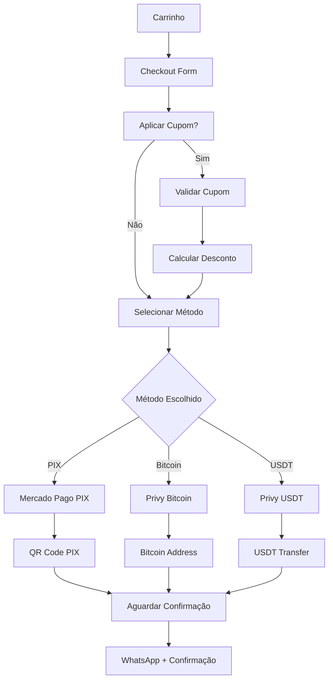

# 🚀 Planejamento para Implementação de Pagamentos Multi-Método com Cupons de Desconto

## 📋 **Análise da Situação Atual**

Seu sistema já possui:
- ✅ Integração com Mercado Pago (configurada para checkout tradicional)
- ✅ Privy configurado para autenticação (com suporte a wallets)
- ✅ Arquitetura limpa com Clean Architecture
- ✅ Sistema de carrinho funcional
- ✅ Fluxo de checkout via WhatsApp

## 🎯 **Plano de Implementação**

### **Fase 1: Extensão das Entidades e Interfaces** 

#### 1.1 Atualizar Entidades de Pagamento
- Expandir `PaymentInfo` para suportar múltiplos métodos
- Adicionar entidade `Coupon` para sistema de desconto
- Criar tipos para Bitcoin/USDT transactions

#### 1.2 Criar Sistema de Cupons
- Interface `ICouponService` para validação e aplicação
- Entidade `DiscountCoupon` com regras de negócio
- Lógica de cálculo de desconto

### **Fase 2: Implementação dos Métodos de Pagamento**

#### 2.1 PIX via Mercado Pago
- Estender `PaymentService` para criar preferências PIX
- Configurar webhook específico para PIX
- Interface de seleção PIX no checkout

#### 2.2 Crypto Payments (Bitcoin/USDT)
- Criar `CryptoPaymentService` usando Privy
- Integração com redes blockchain (Bitcoin, Ethereum/USDT)
- Monitoramento de transações on-chain

#### 2.3 Sistema de Cupons
- Implementar `CouponService` com validação
- Interface de input de cupom no checkout
- Cálculo automático de desconto

### **Fase 3: Interface e Experiência do Usuário**

#### 3.1 Seletor de Método de Pagamento
- Radio buttons para PIX, Bitcoin, USDT
- Preview de valores com desconto aplicado
- Instruções específicas para cada método

#### 3.2 Fluxo de Checkout Atualizado
- Step adicional para seleção de pagamento
- Aplicação de cupom antes da finalização
- Confirmação com valores finais

### **Fase 4: Webhooks e Monitoramento**

#### 4.1 Webhook Unificado
- Processar callbacks de Mercado Pago (PIX)
- Monitorar transações crypto via Privy
- Atualização de status em tempo real

#### 4.2 Sistema de Notificações
- WhatsApp com detalhes do pagamento escolhido
- Confirmações automáticas por método
- Fallback para métodos alternativos

## 🛠️ **Detalhamento Técnico**

### **Estrutura de Arquivos Proposta**

```
src/
├── core/
│   ├── entities/
│   │   ├── Coupon.ts (NOVO)
│   │   ├── CryptoPayment.ts (NOVO)
│   │   └── Order.ts (ATUALIZADO)
│   ├── services/
│   │   ├── ICouponService.ts (NOVO)
│   │   └── ICryptoPaymentService.ts (NOVO)
│   └── use-cases/
│       ├── coupons/ (NOVO)
│       │   ├── ValidateCoupon.ts
│       │   └── ApplyDiscount.ts
│       └── payments/ (NOVO)
│           ├── ProcessPixPayment.ts
│           └── ProcessCryptoPayment.ts
├── infrastructure/
│   └── services/
│       ├── CouponService.ts (NOVO)
│       ├── CryptoPaymentService.ts (NOVO)
│       └── PaymentService.ts (ATUALIZADO)
├── components/
│   └── checkout/
│       ├── PaymentMethodSelector.tsx (NOVO)
│       ├── CouponInput.tsx (NOVO)
│       └── CheckoutForm.tsx (ATUALIZADO)
└── app/api/
    ├── coupons/
    │   └── validate/route.ts (NOVO)
    └── payments/
        ├── crypto/webhook/route.ts (NOVO)
        └── pix/webhook/route.ts (NOVO)
```

### **Configurações Necessárias**

#### Variáveis de Ambiente Adicionais:
```env
# Crypto Payments
NEXT_PUBLIC_BITCOIN_NETWORK=mainnet
NEXT_PUBLIC_ETHEREUM_NETWORK=mainnet
NEXT_PUBLIC_USDT_CONTRACT_ADDRESS=0x...

# Coupon System
COUPON_SECRET_KEY=your_secret_key
NEXT_PUBLIC_COUPON_ENABLED=true

# PIX Configuration
MERCADOPAGO_PIX_ENABLED=true
```

### **Fluxo de Pagamento Proposto**



## 💰 **Sistema de Cupons Proposto**

### **Tipos de Cupom**
- **Percentual**: 10%, 15%, 20% de desconto
- **Valor Fixo**: R$ 50, R$ 100 de desconto
- **Primeira Compra**: Desconto especial para novos usuários
- **Sazonal**: Cupons por temporada/evento

### **Regras de Validação**
- Data de validade
- Limite de uso (por cupom e por usuário)
- Valor mínimo do pedido
- Métodos de pagamento elegíveis

### **Estrutura de Dados do Cupom**

```typescript
interface DiscountCoupon {
  id: string;
  code: string;
  type: 'percentage' | 'fixed_amount';
  value: number; // Percentage (0-100) or amount in cents
  description: string;
  validFrom: Date;
  validUntil: Date;
  maxUses?: number;
  usedCount: number;
  minOrderAmount?: number; // Minimum order value in cents
  applicablePaymentMethods?: PaymentMethod[];
  isActive: boolean;
  createdAt: Date;
  updatedAt: Date;
}
```

## 🔄 **Cronograma de Implementação**

### **Semana 1: Fundação**
- [ ] Atualizar entidades e interfaces
- [ ] Implementar sistema básico de cupons
- [ ] Configurar estrutura de arquivos

### **Semana 2: PIX Integration**
- [ ] Implementar PIX via Mercado Pago
- [ ] Criar interface de seleção PIX
- [ ] Testar fluxo PIX completo

### **Semana 3: Crypto Payments**
- [ ] Implementar Bitcoin payments via Privy
- [ ] Implementar USDT payments via Privy
- [ ] Criar interfaces crypto

### **Semana 4: Integração e Testes**
- [ ] Integrar todos os métodos no checkout
- [ ] Implementar webhooks unificados
- [ ] Testes completos e ajustes

## 🧪 **Estratégia de Testes**

### **Cenários de Teste**
1. **Cupons**: 
   - Cupom válido com desconto percentual
   - Cupom válido com desconto fixo
   - Cupom expirado
   - Cupom já utilizado (limite atingido)
   - Valor do pedido abaixo do mínimo
   - Cupom inválido/inexistente

2. **PIX**: 
   - Pagamento aprovado instantaneamente
   - Pagamento rejeitado
   - Pagamento pendente
   - Timeout de pagamento

3. **Bitcoin**: 
   - Confirmação blockchain (1-6 confirmações)
   - Fees insuficientes
   - Timeout de transação
   - Network congestion

4. **USDT**: 
   - Network fees (Ethereum)
   - Confirmações necessárias
   - Falhas de rede
   - Gas price fluctuation

5. **Fluxo Completo**: 
   - Todos os métodos com cupons válidos
   - Todos os métodos sem cupons
   - Mudança de método durante checkout
   - Cancelamento de pagamento

### **Ambientes**
- **Desenvolvimento**: Testnet para crypto, sandbox Mercado Pago
- **Staging**: Simulação completa com dados reais
- **Produção**: Rollout gradual por método

## 📊 **Métricas e Monitoramento**

### **KPIs Importantes**
- Taxa de conversão por método de pagamento
- Uso de cupons de desconto (% de pedidos com cupom)
- Tempo médio de confirmação por método
- Taxa de abandono no checkout por etapa
- Valor médio do pedido com/sem cupom
- Métodos de pagamento mais populares

### **Alertas Necessários**
- Falhas de webhook (> 5% em 1 hora)
- Transações pendentes há mais de 30 minutos
- Cupons com uso suspeito (mesmo IP/usuário)
- Problemas de conectividade blockchain
- Taxa de erro alta em pagamentos PIX

### **Dashboard Sugerido**
- Gráfico de conversão por método
- Mapa de calor de uso de cupons
- Timeline de transações pendentes
- Alertas em tempo real
- Relatório financeiro consolidado

## 🔐 **Considerações de Segurança**

### **Cupons**
- Hash dos códigos de cupom no banco
- Rate limiting para validação de cupons
- Logs de uso para auditoria
- Prevenção contra ataques de força bruta

### **Crypto Payments**
- Validação de endereços blockchain
- Monitoramento de transações suspeitas
- Timeout apropriado para confirmações
- Backup de chaves privadas (se aplicável)

### **PIX**
- Validação de webhooks Mercado Pago
- Verificação de assinatura digital
- Logs detalhados de transações
- Prevenção contra replay attacks

## 🚀 **Próximos Passos Recomendados**

### **Prioridade 1: Sistema de Cupons**
- Base fundamental para descontos
- Independente dos métodos de pagamento
- Pode ser testado isoladamente
- Impacto imediato nas vendas

### **Prioridade 2: PIX Integration**
- Usa infraestrutura existente (Mercado Pago)
- Método de pagamento popular no Brasil
- Implementação mais simples
- Testes em sandbox disponíveis

### **Prioridade 3: Crypto Payments**
- Mais complexo, requer configuração blockchain
- Público-alvo específico
- Requer testes extensivos
- Maior potencial de diferenciação

### **Prioridade 4: UI/UX Refinements**
- Interface de seleção intuitiva
- Feedback visual claro
- Instruções específicas por método
- Otimização mobile

---

## 📝 **Notas de Implementação**

### **Compatibilidade**
- Manter compatibilidade com fluxo WhatsApp atual
- Fallback graceful para métodos indisponíveis
- Suporte a diferentes moedas (futuro)

### **Performance**
- Cache de validação de cupons
- Lazy loading de componentes crypto
- Otimização de chamadas API
- Compressão de imagens QR Code

### **Acessibilidade**
- Labels apropriados para screen readers
- Contraste adequado em todos os elementos
- Navegação por teclado
- Textos alternativos para ícones

### **Internacionalização (Futuro)**
- Estrutura preparada para múltiplos idiomas
- Formatação de moeda por região
- Métodos de pagamento por país
- Regulamentações locais

---

**Data de Criação**: $(date)
**Versão**: 1.0
**Status**: Planejamento Inicial
**Próxima Revisão**: Após implementação da Fase 1
