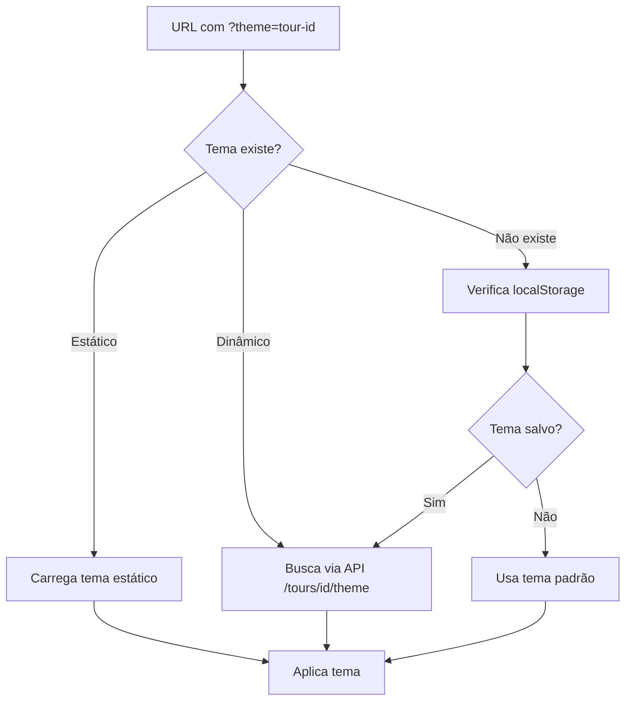

# 🎯 Funcionalidade de Criação de Passeios - Resumo Executivo

## ✅ Funcionalidade Implementada

Foi criada uma **funcionalidade completa para criação de novos passeios** no projeto XperienceClimb, permitindo que os temas e dados mudem dinamicamente de acordo com o passeio selecionado via query parameter.

## 🚀 Principais Características

### 1. **Script de Console Interativo**
- **Arquivo**: `scripts/create-tour.js`
- **Comando**: `npm run create-tour` ou `node scripts/create-tour.js`
- **Funcionalidade**: Coleta todas as informações necessárias via console para criar um novo passeio

### 2. **Sistema de Temas Dinâmico**
- **Seleção via Query Parameter**: `?theme=nome-do-passeio`
- **Prioridade**: URL → localStorage → padrão
- **Suporte a temas estáticos e dinâmicos** (carregados via API)

### 3. **Arquitetura Clean Architecture**
- **Entidades**: `Tour.ts` com estrutura completa de dados
- **Serviços**: `TourService.ts` para lógica de negócio
- **Repositórios**: `TourRepository.ts` para persistência (em memória)
- **Use Cases**: Casos de uso específicos para cada operação

### 4. **APIs REST Completas**
- `GET /api/tours` - Listar todos os tours
- `GET /api/tours/[id]` - Obter tour específico
- `GET /api/tours/[id]/theme` - Obter tema do tour
- `POST /api/tours` - Criar novo tour

## 🎨 Como Funciona o Sistema de Temas

### Fluxo de Seleção de Tema


### Estrutura de Dados do Tour
```typescript
interface Tour {
  id: string;
  name: string;
  themeId: string;
  location: TourLocation;
  description: string;
  activities: TourActivity[];
  logistics: TourLogistics;
  pricing: TourPricing;
  availability: TourAvailability;
  gallery: TourGallery;
  seo: TourSEO;
  // ... outros campos
}
```

## 📋 Dados Coletados pelo Script

### **Informações Básicas**
- ID do tour (kebab-case)
- Nome do tour

### **Localização**
- Nome do local, endereço, cidade, estado
- Coordenadas GPS
- Distância de São Paulo
- URL do Google Maps
- Direções passo-a-passo

### **Conteúdo**
- Títulos e descrições para Hero e About
- Destaques com ícones
- Caixa de informações adicional

### **Atividades**
- Nome, descrição, ícone
- Nível de dificuldade
- Duração e preço

### **Logística**
- Horários de funcionamento
- Ponto de encontro
- Notas importantes e dicas

### **SEO**
- Título, descrição, palavras-chave
- Imagem Open Graph

### **Galeria**
- Imagens com categorias
- Títulos e textos alternativos

## 🔧 Arquivos Criados/Modificados

### **Novos Arquivos**
```
scripts/create-tour.js                          # Script de criação
src/core/entities/Tour.ts                       # Entidade Tour
src/core/services/ITourService.ts               # Interface do serviço
src/core/repositories/ITourRepository.ts        # Interface do repositório
src/infrastructure/services/TourService.ts     # Implementação do serviço
src/infrastructure/repositories/TourRepository.ts # Repositório
src/core/use-cases/tours/                      # Casos de uso
src/app/api/tours/                             # APIs REST
TOUR_CREATION_GUIDE.md                         # Documentação
EXEMPLO_CRIACAO_TOUR.md                        # Exemplo prático
```

### **Arquivos Modificados**
```
src/themes/ThemeProvider.tsx                   # Suporte a temas dinâmicos
package.json                                   # Script create-tour
```

## 🎯 Exemplo de Uso

### 1. Criar Novo Passeio
```bash
npm run create-tour
```

### 2. Acessar com Tema Específico
```
http://localhost:3000?theme=pico-jaragua
http://localhost:3000?theme=fazenda-ipanema
http://localhost:3000?theme=pedra-bela
```

### 3. Resultado
- **Tema muda automaticamente** baseado no query parameter
- **Todos os dados são atualizados**: textos, imagens, SEO, etc.
- **Integração com sistema de pagamentos** existente (PIX, Bitcoin, USDT, GitHub Pay)

## 💡 Benefícios para a Comunidade XperienceClimb

### **Para Instrutores**
- **Criação rápida** de novos passeios em minutos
- **Personalização completa** de conteúdo e visual
- **Gestão independente** sem necessidade de desenvolvedor

### **Para a Plataforma**
- **Escalabilidade** - novos passeios sem modificar código
- **Flexibilidade** - cada passeio com identidade própria
- **Manutenibilidade** - estrutura organizada e documentada

### **Para Clientes**
- **Experiência personalizada** para cada destino
- **Informações específicas** do local escolhido
- **Processo de compra otimizado** por tipo de atividade

## 🚀 Próximos Passos Sugeridos

1. **Testar a funcionalidade** criando um passeio de exemplo
2. **Adicionar imagens** na pasta `public/images/themes/`
3. **Configurar pacotes** específicos para cada tour
4. **Implementar persistência** em banco de dados (opcional)
5. **Criar interface administrativa** para gestão via web (futuro)

## 📞 Como Usar

1. **Execute o script**: `npm run create-tour`
2. **Siga as instruções** no console
3. **Adicione as imagens** na pasta correta
4. **Teste o tema**: `?theme=seu-tour-id`
5. **Configure os pacotes** se necessário

---

**A funcionalidade está 100% implementada e pronta para uso! 🎉**

**Agora você pode criar quantos passeios quiser, cada um com sua própria identidade visual e conteúdo, conectando instrutores certificados com interessados no esporte de escalada.** 🧗‍♀️🏔️
