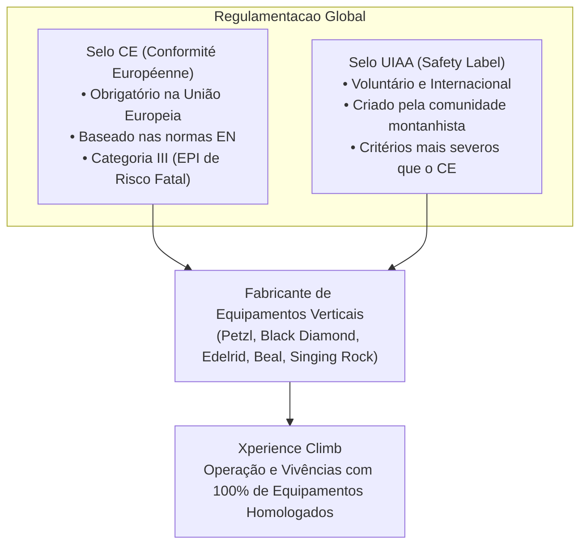
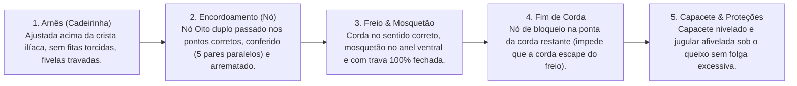

# 🧗 Glossário Técnico: Equipamentos, Certificações (CE/UIAA) e Gestão de Segurança

> _"CE e UIAA são os dois principais selos de segurança e certificação técnica que garantem que equipamentos de escalada, montanhismo e trabalho em altura suportam as cargas e condições para as quais foram projetados."_

- **Versão:** 1.0.0
- **Data de Atualização:** Outubro de 2026
- **Público-alvo:** Instrutores, Guias, Time de Operações, Redação/Copywriting, Atendimento ao Cliente e Time de Produto/SEO da **Xperience Climb**.
- **Contexto:** Referência terminológica, física e regulatória para vivências de escalada em rocha (ex: Pedra Bela - SP, Morro Araçoiaba / Flona Ipanema) e ecoturismo de aventura.

---

## 📌 Sumário

1. [Visão Geral & Importância das Certificações](#1-visão-geral--importância-das-certificações)
2. [Os Grandes Selos de Segurança: CE vs. UIAA](#2-os-grandes-selos-de-segurança-ce-vs-uiaa)
3. [Normas Regulatórias Nacionais e Internacionais](#3-normas-regulatórias-nacionais-e-internacionais)
4. [Física da Escalada: Unidades, Forças e Dinâmica de Queda](#4-física-da-escalada-unidades-forças-e-dinâmica-de-queda)
5. [Glossário Técnico de Equipamentos (EPIs e EPCs)](#5-glossário-técnico-de-equipamentos-epis-e-epcs)
6. [Tabela de Normas Europeias (EN) de Referência](#6-tabela-de-normas-europeias-en-de-referência)
7. [Ciclo de Vida, Rastreabilidade e Critérios de Descarte](#7-ciclo-de-vida-rastreabilidade-e-critérios-de-descarte)
8. [Procedimentos Operacionais: Buddy Check (Checagem Mútua)](#8-procedimentos-operacionais-buddy-check-checagem-mútua)
9. [Manual de Aplicação em Copywriting, SEO e Atendimento](#9-manual-de-aplicação-em-copywriting-seo-e-atendimento)
10. [Tabela "De-Para": Linguagem Leiga vs. Terminologia Técnica](#10-tabela-de-para-linguagem-leiga-vs-terminologia-técnica)

---

## 1. Visão Geral & Importância das Certificações

Na escalada em rocha e no montanhismo, **a falha de um equipamento de proteção individual (EPI) pode ser fatal**. Por essa razão, a indústria de equipamentos verticais é uma das mais rigorosamente reguladas do mundo esportivo e industrial.

Equipamentos confiáveis não são simplesmente "resistentes": eles são submetidos a ensaios laboratoriais destrutivos e cíclicos, simulações de atrito com água e poeira, impactos sob temperaturas extremas (-30 °C a +50 °C) e inspeções de conformidade de lote.

Para a **Xperience Climb**, a conformidade integral com certificações internacionais não é apenas um protocolo operacional: é o alicerce da proposta de valor oferecida aos alunos, famílias e praticantes de primeira viagem.

---

## 2. Os Grandes Selos de Segurança: CE vs. UIAA



### 2.1 CE (Conformité Européenne)

- **O que é:** O selo **CE** é a marcação de conformidade obrigatória para produtos comercializados dentro do Espaço Econômico Europeu (EEE). Para equipamentos de montanhismo e trabalho vertical, aplica-se o **Regulamento Europeu de EPIs (EU 2016/425)**.
- **Classificação de Risco:** Equipamentos de escalada se enquadram na **Categoria III** (equipamentos destinados a proteger contra riscos de consequências mortais ou danos irreversíveis à saúde).
- **Organismo Notificado (Notified Body):** Para ostentar a marcação CE em equipamentos de Categoria III, o fabricante precisa ser auditado por um laboratório credenciado independente. No corpo do equipamento, a sigla CE vem sempre acompanhada de um número de 4 dígitos que identifica o laboratório (ex: `CE 0082` para APAVE, `CE 0123` para TÜV SÜD).

### 2.2 UIAA (Union Internationale des Associations d'Alpinisme)

- **O que é:** Fundada em 1932 em Chamonix (França), a **UIAA** é a federação internacional que governa o montanhismo e a escalada. Em 1960, a UIAA criou a **UIAA Safety Commission**, pioneira no desenvolvimento de normas de teste específicas para o meio outdoor.
- **O UIAA Safety Label:** Trata-se de uma certificação voluntária e de prestígio global. Se um equipamento exibe o selo UIAA, significa que foi aprovado por laboratórios credenciados pela federação e cumpre requisitos próprios que muitas vezes **superam** os padrões da União Europeia.
- **Rigor Diferencial da UIAA:**
  - Em cordas: testes mais rigorosos de retenção de quedas sucessivas em arestas cortantes (_Sharp Edge Resistance_) e índice estrito de impermeabilidade (_UIAA Water Repellent_).
  - Em capacetes: proteção extra contra impactos laterais e penetração em ângulo oblíquo.

### 2.3 Resumo Comparativo: CE vs. UIAA

| Parâmetro                | Selo CE                                                                  | Selo UIAA                                                                    |
| :----------------------- | :----------------------------------------------------------------------- | :--------------------------------------------------------------------------- |
| **Natureza**             | Regulamentação legal governamental (UE).                                 | Certificação técnica esportiva independente.                                 |
| **Obrigatoriedade**      | Obrigatório para venda na Europa e adotado mundialmente como balizador.  | Voluntário; selo de excelência da comunidade montanhista.                    |
| **Norma Base**           | Normas Europeias (série **EN**).                                         | Normas **UIAA Standard** (frequentemente EN + aditivos severos).             |
| **Identificação Visual** | Marcação `CE` seguida do código do organismo notificado (ex: `CE 0082`). | Logo estilizado `UIAA` dentro de um círculo ou retângulo.                    |
| **Banco de Dados**       | Registrado nos relatórios técnicos de conformidade do fabricante.        | Consulta pública online em [theuiaa.org/safety](https://theuiaa.org/safety). |

---

## 3. Normas Regulatórias Nacionais e Internacionais

Além do CE e da UIAA, a operação da Xperience Climb dialoga com padrões industriais e normas brasileiras:

- **Normas EN (European Norms):** Normas técnicas elaboradas pelo CEN (Comitê Europeu de Normalização). Cada categoria de equipamento tem uma numeração dedicada (ex: EN 12275 para mosquetões).
- **ABNT / NBR (Brasil):**
  - **ABNT NBR 15309:** Equipamentos de proteção individual para montanhismo e escalada (harmonizada com as normas EN).
  - **ABNT NBR 16325-1 e 16325-2:** Proteção contra quedas de altura — Dispositivos de ancoragem (Tipos A, B, C, D).
  - **ABNT NBR 15837:** Equipamentos de proteção individual contra queda de altura — Conectores.
- **NR-35 (Norma Regulamentadora 35 - Trabalho em Altura):** Norma do Ministério do Trabalho e Emprego do Brasil. Embora voltada à indústria, estabelece parâmetros essenciais aplicados por instrutores e guias na montagem de linhas de vida, retenção de quedas e uso de EPIs certificados com CA (Certificado de Aprovação) quando atuando em atividades laborais verticais.
- **UIAA 101 a UIAA 130:** Normas da federação internacional que cobrem cordas, fitas, capacetes, proteções móveis, grampos de ancoragem e mosquetões.

---

## 4. Física da Escalada: Unidades, Forças e Dinâmica de Queda

Compreender as grandezas físicas é indispensável para evitar mitos e operar com segurança irrestrita.

### 4.1 O Quilonewton (kN)

Na escalada, não medimos a resistência de um componente em "quilos" (massa), mas sim em **força** (Newton / Quilonewton).

$$\mathbf{1\text{ kN}} = 1.000\text{ N} \approx 101,97\text{ kgf} \approx \mathbf{100\text{ kg sob gravidade terrestre}}$$

- Um mosquetão homologado com resistência de **$24\text{ kN}$ no eixo maior** suporta o impacto equivalente a aproximadamente **2.400 kgf** (o peso de dois carros populares de médio porte suspensos).

### 4.2 Cargas Limites: MBS vs. WLL

- **MBS (Minimum Breaking Strength / Carga Mínima de Ruptura):** Força mínima garantida pelo fabricante na qual o equipamento se rompe sob teste estático em laboratório. Exemplo: um sling de fita com MBS de $22\text{ kN}$.
- **WLL (Working Load Limit / Carga Máxima de Trabalho):** Força máxima que o equipamento deve receber durante a operação rotineira. Geralmente aplica-se um coeficiente de segurança de $1:5$ ou $1:10$ sobre a MBS (muito utilizado em tirolesas, içamentos e resgate).

### 4.3 Fator de Queda ($F_q$)

O **Fator de Queda** mede a severidade potencial de uma queda de escalada. É calculado pela razão entre a distância total da queda livre e o comprimento de corda disponível para absorvê-la:

$$F_q = \frac{\text{Altura da Queda }(h)}{\text{Comprimento de Corda Ativa }(L)}$$

```
Exemplo 1 (Fator Baixo - Seguro):
Escalador subiu 2 metros acima da última proteção com 20 metros de corda desenrolada.
Ele cai 4 metros (2m acima + 2m abaixo da proteção).
Fq = 4m / 20m = 0,2 (Queda suave, impacto bem distribuído ao longo dos 20m).

Exemplo 2 (Fator Alto - Severo / Fator 2):
Escalador sai da parada (ancoragem) e sobe 2 metros sem colocar nenhuma proteção intermediária.
Ele cai 4 metros, caindo diretamente sobre a parada, com apenas 2 metros de corda no sistema.
Fq = 4m / 2m = 2,0 (Impacto violento sobre a parada, o escalador e o assegurador).
```

> [!IMPORTANT]
> Em escalada esportiva e tradicional em rocha natural, o fator de queda varia de **0 a 2**.
> Em vivências de **Top Rope** (corda previamente instalada no topo, comum no batismo de iniciantes da Xperience Climb), o fator de queda é praticamente **zero** ($F_q \approx 0$), resultando em impacto corporal insignificante em caso de perda de aderência.

### 4.4 Força de Choque (Impact Force)

- A **força de choque** é o pico de desaceleração transmitido ao corpo do escalador, à corda e à ancoragem quando a queda é travada.
- O corpo humano suporta forças de desaceleração brusca de até aproximadamente **$12\text{ kN}$** sem sofrer traumas graves internos.
- Por essa razão, a norma **UIAA 101 / EN 892** estipula que nenhuma corda dinâmica simples pode gerar mais de **$12\text{ kN}$** de força de choque em uma queda padrão de laboratório com massa de 80 kg e fator de queda 1,77. As cordas modernas costumam amortecer entre **$7,5\text{ kN}$ e $9,0\text{ kN}$**.

### 4.5 O Efeito Roldana (Fator Polia)

Quando o primeiro de cordada sofre uma queda, a corda passa pelo mosquetão da última proteção e retorna ao assegurador.

Devido à inversão de direção, a ancoragem suporta **a força exercida pelo escalador somada à força exercida pelo assegurador no contraventamento**:

$$\text{Força na Ancoragem} \approx 1,66 \times \text{Força de Choque (considerando o atrito da corda)}$$

Isso explica por que proteções de topo e paradas devem sempre ser equalizadas e certificadas para suportar no mínimo **$15\text{ kN}$ a $22\text{ kN}$**.

---

## 5. Glossário Técnico de Equipamentos (EPIs e EPCs)

### 5.1 Conectores e Mosquetões (EN 12275 / EN 362)

- **Mosquetão (Carabiner):** Conector metálico articulado com gatilho de mola, forjado em liga de alumínio de alta resistência (ex: Duralumínio 7075-T6) ou aço inoxidável.
- **Eixo Maior Fechado (Major Axis):** Sentido longitudinal do mosquetão onde se concentra a maior capacidade de carga (tipicamente $\ge 20\text{ kN}$ a $30\text{ kN}$).
- **Eixo Menor (Minor Axis):** Sentido transversal do mosquetão. Resistência drasticamente reduzida (geralmente entre $7\text{ kN}$ e $10\text{ kN}$). **Nunca solicite um mosquetão no sentido transversal.**
- **Gatilho Aberto (Gate Open):** Condição em que o mosquetão suporta carga enquanto seu gatilho está acidentalmente destravado. Sua resistência cai para cerca de $7\text{ kN}$ a $9\text{ kN}$.
- **Tipos de Mosquetões (Classificação EN 12275):**
  - **Tipo B (Basic):** Mosquetão assimétrico padrão em formato "D", ideal para ancoragens e costuras.
  - **Tipo H (HMS / Pear):** Formato em pera generoso, projetado para manuseio com freios e acomodação de nós volumosos como o Meio Nó de Porco (Munter Hitch).
  - **Tipo K (Klettersteig):** Com abertura larga e trava automática, próprio para via ferrata e tirolesa.
  - **Tipo D (Directional):** Desenhado para manter a fita posicionada no eixo ótimo de tração.
  - **Tipo X (Oval):** Formato simétrico que equilibra polias e equipamentos mecânicos centralizados.
  - **Tipo Q (Quicklink / Maillon Rapide):** Conector de fechamento roscado com chave sextavada, usado em abandono ou ancoragens permanentes (MBS $\ge 25\text{ kN}$).
- **Mecanismos de Fechamento de Segurança:**
  - _Rosca (Screw-Lock):_ Trava manual por rosca metálica. Exige verificação visual do indicador vermelho de alerta.
  - _Automático 2 Tempos (Twist-Lock):_ Gira e abre. Ágil, mas suscetível a abrir por atrito acidental de corda.
  - _Automático 3 Tempos (Triact-Lock / Ball-Lock):_ Empurra, gira e abre. Padrão ouro de segurança para ancoragens críticas e clientes iniciantes.

---

### 5.2 Cordas de Montanhismo (EN 892 / EN 1891)

- **Construção Kernmantle:** Tecnologia desenvolvida pela Edelrid em 1953, composta por uma **Alma (_Kern_)**, que responde por cerca de 70% a 80% da resistência mecânica da corda, e uma **Capa (_Mantel_)**, capa trançada que protege a alma contra abrasão mecânica, raios ultravioleta e poeira.
- **Corda Dinâmica (EN 892):** Corda com alta elasticidade (alongamento dinâmico entre 30% e 40% na primeira queda), concebida para absorver a energia cinética da queda do escalador, limitando o impacto ao corpo.
  - _Corda Simples (Single Rope - Símbolo `①`):_ Usada isoladamente. É a corda padrão utilizada nas vivências e batismos da Xperience Climb (diâmetros típicos entre 9,5 mm e 10,2 mm).
  - _Corda Meia (Half Rope - Símbolo `½`):_ Usada em pares em vias tradicionais e de gelo; o escalador costura alternadamente cada corda.
  - _Corda Gêmea (Twin Rope - Símbolo `∞`):_ Usada em pares, sempre costuradas juntas na mesma proteção.
- **Corda Semi-estática / Estática (EN 1891 Tipo A / B):** Corda de baixo alongamento (< 5%). **Proibida para guiar escalada**, pois uma queda livre geraria impacto severo com risco de ruptura. Uso restrito a:
  - Rapel longo e evacuação;
  - Fixação de linhas de trabalho para instrutores, fotógrafos e resgate;
  - Ascensão por bloqueadores mecânicos (Jumar).
- **Tratamento Dry / UIAA Water Repellent:** Tratamento hidrofóbico nas fibras. De acordo com a UIAA, uma corda certificada não deve absorver mais do que 5% do seu peso em água quando submetida a teste padronizado (cordas sem tratamento absorvem até 50%, perdendo resistência e ganhando peso).

---

### 5.3 Arnês / Cadeirinha / Baudrier (EN 12277)

- **Arnês Pélvico (Tipo C):** O modelo clássico de escalada composto por cinto acolchoado, perneiras ajustáveis, fivelas de travamento automático e anéis porta-materiais.
- **Anel Ventral (Belay Loop):** A fita circular de altíssima densidade que une as duas alças estruturais frontais da cadeirinha. É o ponto de teste mais resistente do arnês (suporta $\ge 15\text{ kN}$ a $25\text{ kN}$). **É onde se conecta o freio de segurança ou a fita de auto-seguro.**
- **Pontos de Encordoamento (Tie-in Loops):** Os laços reforçados superior (cinto) e inferior (perneiras). **É onde a corda deve ser diretamente passada com o Nó Oito Duplo.**
- **Porta-Materiais (Gear Loops):** Alças laterais plásticas ou têxteis. **Não são estruturais** (suportam no máximo 5 a 10 kg). Nunca devem ser utilizados para ancorar o escalador ou prender o freio.

---

### 5.4 Capacetes de Escalada (EN 12492 / UIAA 106)

- **Capacete de Montanhismo (Climbing Helmet):** EPI indispensável para proteção contra quedas de pedras soltas (_rockfall_), impactos contra a parede rochosa e batidas laterais durante uma queda desequilibrada.
- **Testes da Norma EN 12492:**
  - Absorção de choque no topo por percutor cônico pontiagudo e bloco semiesférico de 5 kg solto a 2 metros de altura.
  - Ensaios de impacto lateral, frontal e traseiro.
  - **Resistência da Jugular:** A fivela do queixo deve resistir a uma força de pelo menos **$50\text{ daN}$ (~50 kgf)** sem se abrir, garantindo que o capacete não saia da cabeça durante uma queda repetida.
- **Construção:**
  - _Hard Shell (Casco rígido em ABS com berço de fita ou EPS):_ Robusto e resistente a impactos sucessivos de pedras.
  - _In-Mold (EPS/EPP com fina lâmina de policarbonato):_ Ultraleve, máxima absorção de energia por deformação plástica.

---

### 5.5 Dispositivos de Freio e Asseguramento (EN 15151-1 / EN 15151-2)

- **Freio Tubular (Estilo ATC / Reverso / Tubo):** Dispositivo passivo baseado em atrito manual do cabo curvado em canaletas. Requer atenção total contínua da mão condutora na corda passiva.
- **Dispositivo com Frenagem Assistida (Assisted Braking Device - ABD):**
  - _Mecânicos / Com Came Articulado (ex: Petzl GriGri, Edelrid Pinch):_ Em caso de tranco súbito provocado pela queda, o came interno gira e bloqueia a corda automaticamente.
  - _Geométricos (ex: Mammut Smart, Edelrid Mega Jul):_ A própria geometria do aparelho prensa o mosquetão contra a corda ao sofrer tração.
  - _Relevância Operacional:_ O uso de freios assistidos é padrão recomendado na Xperience Climb para operações de batismo e instrução, pois oferece uma redundância crítica contra desatenção ou solavancos.
- **Freio Oito (Figure 8):** Dispositivo clássico de descida por rapel. Gera torção excessiva na corda (_choca_) e não possui trava assistida; hoje tem uso restrito e não é recomendado para segurança de primeiro de cordada.

---

### 5.6 Fitas Expressas, Slings e Anéis de Fita (EN 566)

- **Fita Expressa (Quickdraw / Costura):** Conjunto formado por dois mosquetões unidos por uma fita curta costurada (_dogbone_). Utilizado para conectar a corda aos pontos de proteção intermediários na rocha.
  - _Mosquetão da Rocha (Gatilho Reto):_ Fica preso na chapeleta/grampo.
  - _Mosquetão da Corda (Gatilho Curvo ou de Arame):_ Formato côncavo para facilitar a entrada ágil da corda pelo escalador.
- **Slings / Fitas Tubulares Costuradas:** Anéis de fita fechados de fábrica em comprimentos variados (30 cm, 60 cm, 120 cm, 240 cm). Resistência mínima nominal de **$22\text{ kN}$** (EN 566).
  - _Poliamida (Nylon):_ Mais elástica, absorve ligeiramente impactos e suporta temperaturas de atrito maiores ($~220\ ^\circ\text{C}$).
  - _Dyneema / UHMWPE (Polietileno de Ultra Alto Peso Molecular):_ Extremamente leve, não absorve água e tem altíssima resistência ao corte, mas tem ponto de fusão baixo ($~140\ ^\circ\text{C}$) e elasticidade próxima a zero (quedas estáticas sobre fita Dyneema geram forças de choque altíssimas).
- **PAS (Personal Anchor System) / Linha de Auto-Seguro Regulável:** Fitas de anéis encadeados ou sistemas dinâmicos (ex: Petzl Connect Adjust) usados para prender o escalador à parada com segurança graduada e sem folga.

---

### 5.7 Sistemas de Ancoragem e Proteções (EN 795 / EN 959 / EN 12270 / EN 12276)

- **Chapeleta (Hanger Plate - EN 959):** Placa metálica angulada fixada na rocha, onde se conecta o mosquetão da costura ou da parada. Fabricada em aço inoxidável 304/316 ou titânio para resistir à corrosão e _Stress Corrosion Cracking_ (SCC).
- **Parabolt / Chumbador Mecânico de Expansão:** Fixador instalado em orifício perfurado com martelete na rocha sólida; a porca expande a presilha interna contra as paredes do furo.
- **Grampo P de Aço Inox (P-Bolt / Glue-In):** Chumbador químico colado com resina epóxi bicomponente. Padrão de altíssima durabilidade adotado no Brasil para vias de alta frequência e rochas abrasivas.
- **Proteção Móvel (Trad Climbing Gear):**
  - _SLCD (Spring-Loaded Camming Device - Friends/Camalots - EN 12276):_ Dispositivo com 3 ou 4 cames rotativos acionados por mola que se expandem contra as fendas da rocha quando tracionados.
  - _Nut / Stopper / Entalador Passivo (EN 12270):_ Peça trapezoidal de alumínio com cabo de aço, entalada por forma física na rocha.
- **Equalização de Ancoragem:** Técnica de distribuição de carga entre dois ou mais pontos independentes de proteção. A força deve ser dividida igualmente, com ângulo de convergência inferior a $60^\circ$ (ângulos superiores a $90^\circ$ multiplicam perigosamente a força sobre cada ponto).

---

## 6. Tabela de Normas Europeias (EN) de Referência

A tabela abaixo compila as principais normas aplicáveis aos equipamentos utilizados nas vivências da Xperience Climb:

| Categoria do Equipamento      | Norma EN        | Norma UIAA | Requisito Principal / Teste Crítico                                                                            |
| :---------------------------- | :-------------- | :--------- | :------------------------------------------------------------------------------------------------------------- |
| **Mosquetões / Conectores**   | EN 12275        | UIAA 121   | Eixo maior fechado $\ge 20\text{ kN}$; Eixo menor $\ge 7\text{ kN}$; Gatilho aberto $\ge 7\text{ kN}$.         |
| **Cordas Dinâmicas**          | EN 892          | UIAA 101   | Força de choque $\le 12\text{ kN}$ (massa 80 kg, queda fator 1,77); mínimo de 5 quedas UIAA retidas.           |
| **Cordas Semi-estáticas**     | EN 1891         | -          | Alongamento estático $\le 5\%$; força de ruptura estática terminal $\ge 22\text{ kN}$ (Tipo A).                |
| **Cadeirinhas / Arneses**     | EN 12277        | UIAA 105   | Teste estático de tração no anel ventral e pontos de encordoamento $\ge 15\text{ kN}$.                         |
| **Capacetes**                 | EN 12492        | UIAA 106   | Força transmitida à cabeça $\le 10\text{ kN}$ sob impacto de 5 kg a 2m; retenção da jugular $> 50\text{ daN}$. |
| **Fitas Expressas / Slings**  | EN 566          | UIAA 104   | Carga de ruptura estática $\ge 22\text{ kN}$ em fita montada/costurada.                                        |
| **Dispositivos de Freio**     | EN 15151-1 / -2 | UIAA 129   | Capacidade de frenagem estática e dinâmica para cordas de diâmetros especificados.                             |
| **Grampos e Chapeletas**      | EN 959          | UIAA 123   | Resistência ao arrancamento axial $\ge 15\text{ kN}$ e cisalhamento radial $\ge 25\text{ kN}$.                 |
| **Bloqueadores / Ascensores** | EN 567          | UIAA 126   | Resistência mecânica e retenção na corda sem esmagamento da capa até $4\text{ kN} - 6,5\text{ kN}$.            |
| **Polias**                    | EN 12278        | UIAA 127   | Carga mínima de ruptura estática estrutural $\ge 15\text{ kN} - 22\text{ kN}$.                                 |

---

## 7. Ciclo de Vida, Rastreabilidade e Critérios de Descarte

Segurança de equipamentos não depende apenas da compra de itens certificados, mas sim do **controle contínuo de envelhecimento e degradação**.

### 7.1 Rastreabilidade e Marcações Obrigatórias

Todo equipamento certificado deve conter gravações a laser (metais) ou etiquetas costuradas (têxteis) com:

- Nome ou marca do fabricante (ex: _Petzl_, _Black Diamond_);
- Selos de certificação: `CE XXXX` e logo `UIAA`;
- Norma de conformidade (ex: `EN 12275:2013`);
- Resistência nominal em kN (ex: `↔ 24 ↨ 8 ◒ 8 kN`);
- **Número de Série Individual e Data de Fabricação** (ex: `22G0123456` indicando o ano de 2022).

### 7.2 Vida Útil Teórica vs. Vida Útil Real

| Material                                       | Vida Útil Máxima em Estoque (Sem Uso)                          | Vida Útil em Uso Regular na Xperience Climb                                                |
| :--------------------------------------------- | :------------------------------------------------------------- | :----------------------------------------------------------------------------------------- |
| **Têxteis (Cordas, Slings, Baudriers, Fitas)** | Até 10 anos a partir da data de fabricação.                    | **1 a 3 anos**, dependendo da frequência, exposição solar e desgaste visual.               |
| **Plásticos (Capacetes em ABS/EPS)**           | Até 10 anos.                                                   | **3 a 5 anos**, ou descarte imediato após queda de pedra de grande impacto.                |
| **Metais (Mosquetões, Freios, Placas)**        | Ilimitada (desde que armazenado em local seco e sem corrosão). | **Indeterminada**, inspecionada visualmente por desgaste de canaleta (< 1 mm de desgaste). |

### 7.3 Gatilhos Imediatos para Descarte e Aposentadoria de EPIs

O equipamento deve ser retirado de serviço e inutilizado fisicamente (cortado com tesoura ou inutilizado por deformação mecânica) se apresentar:

1. **Contato com reagentes químicos agressivos:** Ácido sulfúrico de baterias, solventes, alvejantes ou combustíveis.
2. **Queda de grande fator:** Corda dinâmica submetida a uma queda severa próxima ao fator 2.
3. **Deformação plástica ou fissuras:** Trincas microscópicas, folgas no pino do gatilho ou deformação do corpo metálico do mosquetão após queda no solo rochoso.
4. **Desgaste abrasivo severo:** Sulcos de atrito na curva de trabalho de mosquetões ou freios superiores a **1 mm** (ou mais de 10% da espessura original da liga).
5. **Danos na alma da corda:** Esmagamentos palpáveis (_hernias_), caroços internos ou alma exposta através da capa desfiada.
6. **Vidrificação térmica (_Glaze_):** Fitas ou capas de corda endurecidas e brilhantes devido a derretimento superficial por fricção violenta.

---

## 8. Procedimentos Operacionais: Buddy Check (Checagem Mútua)

Antes de qualquer participante ou instrutor tirar os pés do chão na Xperience Climb, é obrigatório realizar em voz alta o **Partner Check** (Checagem Cruzada de Segurança), inspecionando os 5 elos vitais:



---

## 9. Manual de Aplicação em Copywriting, SEO e Atendimento

Como transformar a solidez técnica de segurança em confiança para o cliente final sem gerar medo ou sobrecarga de jargões técnicos:

### 9.1 Diretrizes de Comunicação com o Cliente

- **Foque no Benefício Humano:** Iniciantes e famílias buscam viver a natureza com paz de espírito. Não jogue apenas siglas soltas; explique o que elas significam na prática:
  - _Evite:_ "Usamos equipamentos EN 12275 e EN 892 para garantir retenção de força de choque em $12\text{ kN}$."
  - _Prefira:_ "Você escalará com equipamentos de ponta certificados pelos mais rigorosos órgãos internacionais (CE e UIAA), garantindo que cada cabo e mosquetão suporte o peso equivalente a um carro."
- **Evite Promessas Absolutas Irreais:**
  - _Nunca afirme:_ "Risco 100% zero de acidente." (Na gestão de risco de aventura, o risco é mitigado tecnicamente e administrado, nunca inexistente).
  - _Adote:_ "Protocolo de segurança máxima com guias qualificados, equipamentos duplamente homologados e seguro de aventura individual incluso."

### 9.2 Snippets Prontos para Landing Pages, FAQ e SEO

#### Para a Meta Description (SEO):

> _"Vivência de escalada em rocha para iniciantes em SP. Equipamentos 100% homologados CE/UIAA, instrutores experientes, seguro aventura e visual inesquecível. Reserve já!"_

#### Para a Seção de Perguntas Frequentes (FAQ):

```markdown
**Pergunta: Nunca escalei antes. Os equipamentos são realmente seguros?**
Resposta: Sim, total segurança! Todos os nossos equipamentos (cordas, capacetes, cadeirinhas e mosquetões) possuem as certificações internacionais CE (Comunidade Europeia) e UIAA (União Internacional das Associações de Alpinismo). Nossos mosquetões suportam mais de 2.000 kg de carga e você escala no sistema de Top Rope, onde a corda fica previamente instalada no topo, sem risco de quedas livres. Além disso, antes de cada subida, nosso instrutor realiza a checagem dupla de segurança.
```

#### Para o Voucher / E-mail de Confirmação:

> _"Sua segurança é nossa prioridade absoluta. Todos os equipamentos disponibilizados em sua vivência são revisados individualmente, higienizados e possuem certificações de segurança internacionais UIAA e CE."_

---

## 10. Tabela "De-Para": Linguagem Leiga vs. Terminologia Técnica

Utilize esta tabela para calibrar a comunicação entre o time técnico de solo e o time de atendimento / marketing:

| Termo Usado pelo Cliente Leigo    | Terminologia Técnica Correta                               | Como Explicar ao Cliente com Elegância                                                                                                                                         |
| :-------------------------------- | :--------------------------------------------------------- | :----------------------------------------------------------------------------------------------------------------------------------------------------------------------------- |
| _"Cinto de segurança"_            | **Arnês / Cadeirinha / Baudrier (EN 12277)**               | "O arnês é uma cadeirinha acolchoada e ergonômica que veste confortavelmente sua cintura e pernas, permitindo que você se movimente com total liberdade e sustentação."        |
| _"Gancho metálico"_               | **Mosquetão com trava de segurança (EN 12275)**            | "Nossos conectores são mosquetões de liga especial ultrarresistente com trava automática que não abre por engano e suportam toneladas."                                        |
| _"Corda comum de amarrar"_        | **Corda Dinâmica Kernmantle (EN 892)**                     | "Utilizamos cordas dinâmicas de alta tecnologia desenvolvidas exclusivamente para escalada. Elas possuem elasticidade controlada para amaciar qualquer parada sem solavancos." |
| _"Aparelho de descida / pecinha"_ | **Dispositivo de Freio Assistido (ex: GriGri / EN 15151)** | "O instrutor utiliza um freio com sistema mecânico de bloqueio assistido que trava a corda instantaneamente caso você queira parar para descansar ou apreciar a paisagem."     |
| _"Presilha furada na pedra"_      | **Chapeleta e Ancoragem Fixa (EN 959)**                    | "As paredes onde operamos contam com ancoragens de alta engenharia chumbadas quimicamente na rocha maciça para sustentação absoluta da corda."                                 |
| _"Segurar a corda lá embaixo"_    | **Dar Segurança / Assegurar (Belaying)**                   | "Dar segurança é o ato técnico onde o instrutor gerencia a tensão da corda a cada centímetro que você sobe, mantendo você sempre protegido."                                   |

---

## 📚 Documentos e Recursos Relacionados no Projeto

- [ADR 0001: Estratégia de SEO e Copywriting](file:///Users/govinda/projetos/XperienceClimb/docs/adr/0001-estrategia-seo-layout-metadata.md)
- [Componente Frontend: `SafetySection.tsx`](file:///Users/govinda/projetos/XperienceClimb/src/components/sections/SafetySection.tsx)
- [README Oficial da Plataforma](file:///Users/govinda/projetos/XperienceClimb/README.md)
- [Diretrizes de Design e Identidade](file:///Users/govinda/projetos/XperienceClimb/.agents/rules/AGENTS.md)
- Portal Oficial de Certificados da UIAA: [theuiaa.org/safety](https://theuiaa.org/safety)
