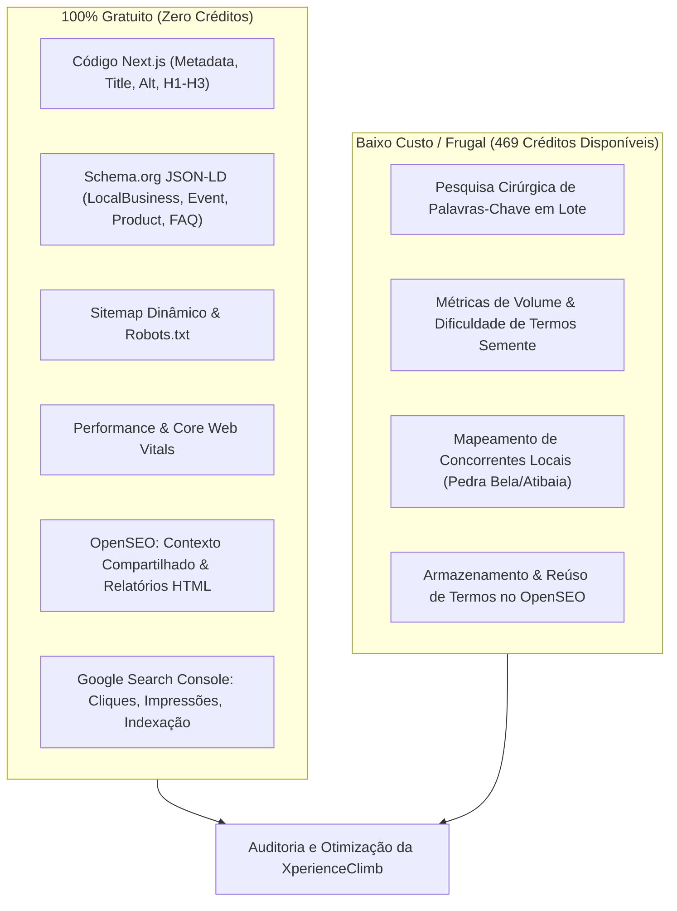

# Guia de SEO, Ferramentas & Estratégia Frugal — XperienceClimb

Este documento apresenta a estratégia completa de Search Engine Optimization (SEO) da **XperienceClimb** (`climb.xperiencehubs.com`), detalhando tudo o que podemos fazer sem custo (100% gratuito), como utilizar créditos e APIs externas de forma frugal, e como operar as skills integradas ao agente.

---

## 1. O que Podemos Fazer: Gratuito vs. Baixo Custo



### 1.1. Ações 100% Gratuitas (Custo Zero)

1. **Otimização On-Page e Código Next.js (App Router):**
   - **Títulos e Descrições:** Otimização dos campos `title` e `description` no `src/app/layout.tsx` e páginas específicas com foco em conversão e busca local.
   - **Hierarquia de Títulos:** Garantia de 1 único `<h1>` por página e estruturação lógica de `<h2>` e `<h3>`.
   - **Acessibilidade e SEO Visual:** Atributos `alt` descritivos em todas as imagens renderizadas por `next/image` e links com textos âncora ricos.
   - **Rastreabilidade Técnica:** Manutenção de `src/app/sitemap.ts` e `src/app/robots.ts` para indexação imediata pelo Googlebot.
2. **Dados Estruturados Ricos (Schema.org):**
   - No arquivo `src/components/seo/StructuredData.tsx`, o grafo já inclui:
     - `LocalBusiness` e `SportsActivityLocation`: Endereço de encontro em Pedra Bela, coordenadas GPS e horários de funcionamento.
     - `TouristAttraction`: Relevância para o turismo da Pedra do Santuário.
     - `Event`: Datas das próximas saídas com localização e organizador.
     - `Product` e `Offer`: Pacotes Básico, Intermediário e Avançado com preços e disponibilidade.
     - `FAQPage`: Perguntas e respostas estruturadas para conquistar rich snippets no Google.
3. **Contexto Central no OpenSEO:**
   - O armazenamento de metas do negócio, personas, UVP (proposta única de valor) e páginas-chave no OpenSEO é gratuito e compartilhado com o agente.
4. **Relatórios HTML Nativos:**
   - Geração e arquivamento de relatórios de auditoria no dashboard do OpenSEO sem consumo de cota.
5. **Google Search Console (GSC):**
   - Consulta de cliques reais, impressões, CTR médio e status de rastreamento de URLs indexadas.

---

### 1.2. Ações de Baixo Custo / Frugal (Usando os 469 Créditos)

O OpenSEO consome créditos apenas quando consulta a base do DataForSEO para dados de mercado externo:

- **Pesquisa Cirúrgica de Palavras-Chave (`keyword-research`):**
  - Consultar volume, CPC e dificuldade apenas para termos prioritários com alta intenção de compra (ex: _"batismo de escalada em rocha"_, _"curso de escalada iniciante sp"_, _"escalada pedra bela"_).
- **Análise de Concorrentes (`competitor-analysis`):**
  - Analisar as palavras-chave que posicionam empresas concorrentes de turismo de aventura ou escolas de escalada no interior paulista.
- **Auditoria de SERP Local (`local-seo`):**
  - Verificar a visibilidade no Google Maps para termos como "escola de escalada" na região metropolitana de SP e Circuito das Águas.

> [!TIP]
> **Regra de Ouro da Frugalidade:** Nunca busque termos genéricos individualmente. Faça pesquisas em lotes e salve sempre os termos no OpenSEO (`save_keywords`), evitando recomprar dados já consultados.

---

## 2. Configuração de Ambiente (`.env.local`)

As variáveis de integração de SEO configuradas no projeto são:

```bash
# Integração Oficial OpenSEO MCP
OPENSEO_API_KEY=oseo_sua_chave_aqui
OPENSEO_PROJECT_ID=0e5c4f70-39ed-4b1f-a90f-f46de87b4281
OPENSEO_BASE_URL=https://app.openseo.so/mcp

# Acesso Direto DataForSEO
DATAFORSEO_LOGIN=seu_login@email.com
DATAFORSEO_PASSWORD=sua_senha_aqui
DATAFORSEO_AUTH_BASE64=seu_base64_aqui
DATAFORSEO_API_KEY=sua_chave_aqui
```

> [!NOTE]
> Para controle de segurança perimetral via IP no painel do DataForSEO, consulte o [Tutorial de Controle de Acesso IP](file:///Users/govinda/projetos/XperienceClimb/docs/TUTORIAL_DATAFORSEO_ACESSO_IP.md).

---

## 3. As Skills Disponíveis no Projeto

Você pode invocar as skills a qualquer momento conversando com o assistente:

| Skill                   | Escopo                                                   | Custo               | Quando Usar                                                                                             |
| :---------------------- | :------------------------------------------------------- | :------------------ | :------------------------------------------------------------------------------------------------------ |
| **`free-seo`**          | On-Page, Código, Schemas, Sitemap, GSC                   | **Gratuito**        | Ao criar/editar páginas, refatorar componentes visuais, revisar tags e dados estruturados.              |
| **`frugal-seo`**        | Auditoria Geral, Classificação de Issues e Ações em Lote | **Mínimo / Frugal** | Para diagnosticar o site, ranquear prioridades de correção (P0 a P3) e planejar pesquisas com créditos. |
| **`seo-project-setup`** | Contexto do Negócio no OpenSEO                           | **Gratuito**        | Para atualizar o público-alvo, localização e UVP da XperienceClimb.                                     |
| **`seo-report`**        | Relatórios HTML                                          | **Gratuito**        | Para gerar documentos executivos de acompanhamento.                                                     |
| **`keyword-research`**  | Inteligência de Mercado                                  | **Créditos**        | Para validar volume e CPC de novas palavras-chave.                                                      |

---

## 4. Processo de Avaliação de Issues de SEO

Ao rodar uma auditoria com a skill `frugal-seo`, os problemas identificados são classificados segundo a matriz:

```
[P0 - Bloqueador] -> Impede indexação ou rastreamento (Corrigir imediatamente)
   ├── Erros 404/500 no sitemap
   ├── Tag 'noindex' indevida
   └── robots.txt bloqueando páginas principais

[P1 - Alto Impacto] -> Reduz diretamente o posicionamento orgânico
   ├── Title tag ausente ou sem palavras-chave
   ├── H1 inexistente ou duplicado
   ├── Schema.org inválido ou desatualizado
   └── Imagens sem atributo alt relevante

[P2 - Médio Impacto] -> Oportunidades de crescimento e CTR
   ├── Meta descriptions com CTR baixo no Search Console
   ├── Falta de FAQs estruturadas
   └── Oportunidade de links internos contextuais

[P3 - Melhoria Contínua] -> Expansão de autoridade
   ├── Criação de artigos de blog sobre nós, equipamentos e vias
   └── Páginas dedicadas a novas cidades da região
```

---

## 5. Exemplos de Comandos para o Agente

Você pode pedir ações diretas como:

- _"Execute a skill `free-seo` para revisar todas as tags e schemas da home."_
- _"Faça uma auditoria frugal de SEO avaliando as principais issues do projeto."_
- _"Atualize o contexto do projeto no OpenSEO com o foco em batismo de escalada na Pedra Bela."_
- _"Pesquise de forma econômica 3 palavras-chave de alta intenção para novos pacotes de escalada."_
