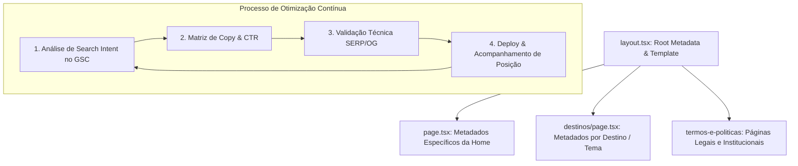

# ADR 0001: Estratégia de SEO, Governança de Metadados e Processo de Conteúdo para o Root Layout (`layout.tsx`)

- **Status:** Proposto / Em Avaliação
- **Data:** 19 de Setembro de 2026
- **Decisores:** Time de Produto, Engenharia Frontend e Especialista em SEO/Growth
- **Contexto do Projeto:** Xperience Climb (`climb.xperiencehubs.com`)

---

## 1. Contexto & Diagnóstico Atual

O arquivo [`src/app/layout.tsx`](../../src/app/layout.tsx) é o **Root Layout** da aplicação no Next.js App Router. Ele atua como a espinha dorsal de metadados padrão para todas as páginas da plataforma.

### 1.1 O Negócio Xperience Climb

A Xperience Climb opera no nicho de **ecoturismo de aventura e batismo de escalada em rocha natural**, conectando iniciantes, famílias, grupos e praticantes de ginásio a experiências guiadas com segurança total (equipamentos certificados UIAA/CE, seguro aventura e instrutores qualificados).
Atualmente, opera com foco principal em **Pedra Bela - SP (Pedra do Santuário)** e possui arquitetura preparada para múltiplos destinos (ex: **Fazenda Ipanema / Flona Ipanema** e futuros polos).

### 1.2 Problemas Identificados no Estado Atual

1. **Acoplamento excessivo no Root Layout:** Os títulos e descrições do `layout.tsx` estão fixados estritamente no destino "Pedra Bela", dificultando o SEO multilocação quando novas páginas de destinos (ex: Fazenda Ipanema) ou novos pacotes forem indexados.
2. **Ausência de `title.template`:** O título atual é uma string única estática. Não se utiliza o padrão recomendado do Next.js `title: { default: '...', template: '%s | Xperience Climb' }`, o que leva a inconsistências nos títulos de páginas secundárias.
3. **Asset OpenGraph desotimizado:** O arquivo `/images/site.png` referenciado no Open Graph possui **~5,1 MB**, o que excede os limites recomendados de mensageiros (WhatsApp, Telegram e iMessage limitam ou descartam previews de imagens acima de 300 KB – 1 MB), prejudicando o compartilhamento orgânico.
4. **Falta de um processo padronizado de copy:** As tags de SEO eram modificadas de forma reativa após erros de auditoria (ex: títulos > 60 caracteres ou descrições > 160 caracteres), sem um framework baseado na intenção de busca do usuário e em dados reais de cliques (CTR) e conversão.

---

## 2. A Decisão Arquitetural e Estratégica

Decidimos reestruturar o `src/app/layout.tsx` e formalizar um **Processo Contínuo de Descoberta e Governança de Conteúdo SEO** baseado em 4 pilares:

---

### Pilar 1: Arquitetura de Metadados em Camadas (Next.js App Router)

1. **Root Layout (`src/app/layout.tsx`):**
   - Deve conter a **identidade da marca mãe** e fallbacks defensivos.
   - Implementar `title.template: '%s | Xperience Climb'`.
   - Conter diretivas técnicas universais (`metadataBase`, `robots` com `max-snippet`, `max-image-preview: large`, `icons`, `manifest`).
2. **Página Inicial (`src/app/page.tsx`):**
   - Exportar seu próprio objeto `metadata` com foco na palavra-chave primária de alta conversão comercial (ex: _"Batismo de Escalada em Rocha | Experiência Iniciante em SP"_).
3. **Páginas de Destino / Rotas Dinâmicas:**
   - Cada destino sobrescreve título e descrição (`generateMetadata`), aproveitando o template do layout raiz.
   - Exemplo: `title: 'Escalada na Fazenda Ipanema'` -> resultado gerado: _"Escalada na Fazenda Ipanema | Xperience Climb"_.

---

### Pilar 2: Matriz de Intenção de Busca do Negócio

O conteúdo textual das tags de SEO deve responder às três principais personas da Xperience Climb:

| Intenção de Busca                 | Palavras-Chave Alvo                                                                      | Dor do Usuário                                                                 | Âncora de Conversão no Snippet                                                                   |
| :-------------------------------- | :--------------------------------------------------------------------------------------- | :----------------------------------------------------------------------------- | :----------------------------------------------------------------------------------------------- |
| **Transacional / Fundo de Funil** | `batismo de escalada sp`, `onde escalar em pedra bela`, `curso de escalada iniciante sp` | Medo de segurança, incerteza sobre pré-requisitos, busca por preço/reserva.    | _"Instrutores certificados, equipamentos UIAA/CE, seguro e almoço incluso. Reserve sua vaga!"_   |
| **Local / Ecoturismo**            | `passeios em pedra bela`, `o que fazer em pedra bela sp`, `pedra do santuario escalada`  | Procurando turismo de aventura "bate e volta" a 1h30 da capital / Campinas.    | _"A melhor experiência de aventura em Pedra Bela - SP. Visual panorâmico e estrutura completa."_ |
| **Transição Ginásio -> Rocha**    | `escalada em rocha para iniciantes`, `primeira vez na rocha sp`                          | Já faz boulder/top rope indoor e quer viver a rocha real com instrução guiada. | _"Dê o próximo passo do indoor para a rocha natural com guiamento técnico."_                     |

---

### Pilar 3: Otimização de Assets e Snippets Sociais

1. **Open Graph Image dedicada (`site-og.jpg` ou `.webp`):**
   - Dimensões: exatas **1200 x 630 px** (proporção 1.91:1).
   - Peso do arquivo: **máximo de 250 KB** (evitando o atual `site.png` de 5,1 MB).
   - Elementos visuais: Fotografia real e inspiradora de escalador em rocha natural, com lettering editorial discreto: _"Batismo de Escalada em Rocha Natural · Xperience Climb"_.
2. **Tags de Rastreamento & Rich Snippets:**
   - Manter a injeção do componente `<StructuredData />` com schemas completos (`TouristAttraction`, `SportsActivityLocation`, `Product`, `Event`, `FAQPage`).

---

### Pilar 4: Processo Contínuo de Melhoria de Conteúdo (Workflow Trimestral)

Para que o SEO gere resultados crescentes para o negócio, estabelece-se o seguinte fluxo de governança:

#### Etapa 1: Diagnóstico Mensal via Google Search Console (GSC)

- Filtrar páginas com **alto volume de impressões mas CTR abaixo de 3%**.
- Identificar termos exatos que usuários digitaram (ex: _"escalada para quem nunca escalou sp"_).

#### Etapa 2: Framework de Redação de Snippets (Fórmula de Alta Conversão)

Toda alteração de título e descrição deve seguir a fórmula:

- **Title (máx. 58 caracteres):** `[Ação/Produto Principal] em [Destino] | [Marca]`
  - _Exemplo Global (layout.tsx):_ `Vivência de Escalada em Rocha | Xperience Climb` (48 chars)
  - _Exemplo Página Home (page.tsx):_ `Vivência de Escalada em Pedra Bela - SP | Xperience Climb` (56 chars)
  - _Diretriz de Posicionamento:_ Priorizar o termo **"Vivência de Escalada"** em detrimento de termos técnicos de nicho como "Batismo", que podem soar intimidados para o público iniciante/famílias.
- **Description (entre 140 e 155 caracteres):** `[Proposta de Valor]. [Segurança/Diferencial]. [Comodidade]. [CTA].`
  - _Exemplo:_ `Vivências de escalada em rocha e ecoturismo de aventura no interior de SP. Guias certificados, equipamentos homologados UIAA/CE, seguro e almoço incluso.` (152 chars)

#### Etapa 3: Homologação Pré-Deploy

Antes de mesclar qualquer alteração em `layout.tsx` ou metadados de páginas:

1. Validar contagem de caracteres (`title ≤ 58`, `description ≤ 155`).
2. Testar renderização estática: `npm run build` e inspecionar os arquivos `.next/server/app/*.html`.
3. Validar se não há regressão de SSR/Suspense (garantir `wordCount > 1000` e tag `<h1>` presente no HTML inicial).
4. Validar preview com ferramentas de Open Graph (ex: Facebook Sharing Debugger, opengraph.xyz).

---

## 3. Consequências

### Positivas

- **Prevenção de regressões:** Elimina erros de snippets truncados e duplicações acidentais de títulos.
- **Escalabilidade Multi-Destino:** Prepara o projeto para suportar novas localidades (Pedra Bela, Ipanema, etc.) sem conflito de metadados.
- **Aumento de CTR Orgânico e Social:** Previews no WhatsApp e Google carregarão instantaneamente com visual profissional e copy orientada a valor.
- **Decisões Guiadas por Dados:** Mudanças no texto deixam de ser subjetivas e passam a ser orientadas por dados de busca reais do negócio.

### Trade-offs & Riscos Mitigados

- **Esforço de Manutenção:** Exige que novas páginas definam metadados explicitamente quando precisarem de títulos específicos (mitigado pelo uso do `title.template` no layout raiz).
- **Cache em Redes Sociais:** Ao alterar o Open Graph, pode haver atraso de propagação de cache em redes sociais (mitigado com versionamento de query string na URL da imagem, ex: `site-og.jpg?v=2`).

---

## 4. Plano de Ação Imediato (Roadmap)

1. [ ] **Refatorar `src/app/layout.tsx`:** Adicionar `title.template` e estruturar metadados base corporativos.
2. [ ] **Mover metadados específicos para `src/app/page.tsx`:** Garantir que a Home controle seu título específico focado em conversão.
3. [ ] **Criar asset otimizado de Open Graph:** Gerar `public/images/site-og.jpg` com 1200x630 px e peso < 250 KB.
4. [ ] **Configurar rotina de revisão:** Configurar alertas de desempenho no Google Search Console para termos chave de escalada.
