# RFC: Integração com Sanity CMS (Gerenciamento de Conteúdo, Destinos e Pacotes)

- **Autor:** Antigravity AI Pair Programmer
- **Data:** 16 de Julho de 2026
- **Status:** Proposta (Para Discussão)
- **Área:** CMS / Infraestrutura / Frontend

---

## 1. Contexto e Objetivos

O **XperienceClimb** é um portal dinâmico que oferece experiências de escalada em rocha natural. Atualmente, a aplicação é executada em Next.js 15 e adota os padrões de **Clean Architecture** e **Domain-Driven Design (DDD)**. 

No entanto, o gerenciamento de conteúdo e configurações cruciais do sistema está acoplado ao código-fonte:
- **Pacotes** (como *Agarrão*, *Crux*, *Alma Vertical* e o pacote premium *Xperience Anual*) são definidos de forma estática no arquivo `src/lib/constants.ts`.
- **Destinos** (como *Pedra Bela* e *Fazenda Ipanema*) possuem arquivos TypeScript dedicados (`src/themes/configs/`) que combinam dados de texto, coordenadas geográficas, imagens e paletas de cores.
- **Destino Ativo** (onde ocorrerá o próximo evento) é resolvido dinamicamente no frontend com base no primeiro tour ativo retornado por um repositório em memória (`TourRepository.ts`), ou através de fallback estático.

### Objetivos da Integração com o Sanity CMS
1. **Foco em Destinos (Eventos Bimestrais):** A cada 2 meses teremos um destino de evento diferente. A gestão no CMS será feita através de um cadastro direto de **Destinos (destination)**. O administrador simplesmente preenche os dados do local (fotos, como chegar, descrição, etc.) e as cores específicas desse destino.
2. **Definição Direta do Próximo Destino:** No Singleton do CMS, o administrador simplesmente aponta qual dos destinos cadastrados será o **próximo destino (next active event)**. O portal carrega automaticamente todas as informações e a identidade visual do local selecionado como padrão.
3. **Edição 100% Dinâmica da Página:** Permitir que o gestor (Marcos) altere todas as seções do site (Hero, Sobre, Iniciantes, Calendário, Pacotes, Cronograma, Galeria, Segurança, Comunidade, Parceiros, Localização e Rodapé) de forma autônoma.
4. **Pacote Anual Dinâmico (Xperience Anual):** Integrar o pacote anual como um documento gerenciável no CMS, contendo sua programação bimestral (agenda de saídas e links para os destinos cadastrados).
5. **Preservação da Clean Architecture:** Integrar o CMS através de novos adaptadores na camada de *Infrastructure*, sem violar os contratos de repositórios e entidades do *Domain*.
6. **Performance de Excelência:** Garantir carregamentos rápidos (< 3 segundos) utilizando Next.js ISR (Incremental Static Regeneration) via tags de revalidação acionadas por webhooks do Sanity.

---

## 2. Requisitos de Negócio e Funcionais

### 2.1 Cadastro de Destinos (`destination`)
Esta coleção representa os pontos de escalada onde os eventos são executados (ex: Pedra Bela Vista, Morro Araçoiaba, etc.). Cada documento é independente e contém sua própria identidade de conteúdo e visual.
* **Campos Requeridos:**
  - ID (slug), Nome do Destino, Município e Estado.
  - **Identidade Visual Direta:** Cores HEX específicas deste destino (primária, hover, destaque/accent, fundo da página, superfície/cards, texto principal, gradientes).
  - **Acesso e Localização:** Endereço completo, distância de SP, coordenadas geográficas (lat/lng), link oficial do Google Maps e passos passo-a-passo de rota ("Como Chegar").
  - **Logística do Destino:** Ponto de encontro, horários recomendados, dicas e observações importantes.
  - **Conteúdo Editorial do Destino:** Textos específicos do destino para o Hero, About (Sobre a região, geologia e história) e Iniciantes (recomendações específicas).
  - **Mídia do Destino:** Galeria de imagens e vídeos específicos da paisagem e escalada local.
  - **Segurança Específica:** Lista de equipamentos sugeridos, regras do parque e procedimentos de emergência.

### 2.2 Gerenciamento de Pacotes (Pacotes de Escalada)
O CMS deve permitir gerenciar as opções de ingressos oferecidos aos escaladores, incluindo opções de saídas unitárias e a assinatura premium.
* **Tipos de Pacotes:**
  - **Pacote Padrão (Single-Trip):** Vinculado ao evento ativo atual.
  - **Pacote Anual (Multi-Trip):** Assinatura com saídas bimestrais. Contém uma lista ordenada (`annualSchedule`) de destinos planejados ao longo do ano, onde cada etapa referencia diretamente um documento da coleção de **Destinos** (`destination`).
  - **Preço Sob Consulta (isQuotation):** Permite exibir "Sob Consulta" e colher orçamentos via WhatsApp.

### 2.3 Gerenciamento do Próximo Evento (Destino Ativo - Singleton)
Centralizado no documento `siteSettings`:
1. **Destino Ativo (Active Destination):** Referência para um documento de `destination`. Ao selecionar este local, o frontend carrega todo o conteúdo dele e aplica a identidade visual configurada nele.
2. **Data do Próximo Evento:** Texto exibido no banner de destaque de datas (ex: "11 de Julho de 2026").
3. **Contatos Globais:** WhatsApp, e-mail e rede social.
4. **Footer Settings:** Logos de certificação e termos de uso.

---

## 3. Proposta de Modelagem de Dados (Sanity Schemas)

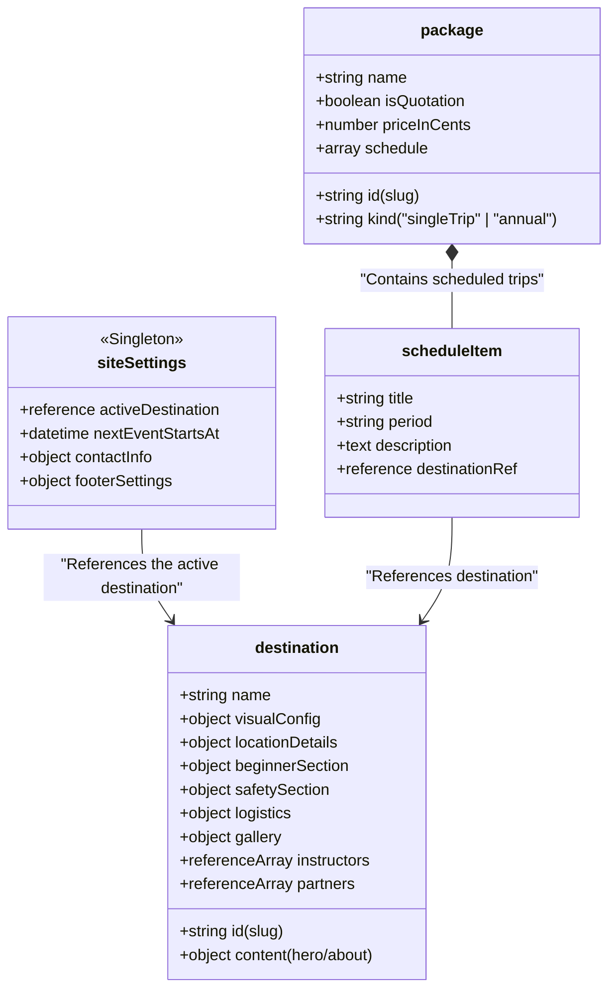

### 3.1 Esquema `destination`
Contém todas as configurações de seções, conteúdos e a identidade cromática específica de cada local de evento.

```typescript
// sanity/schemaTypes/destination.ts
export default {
  name: 'destination',
  title: 'Climbing Destination',
  type: 'document',
  fields: [
    { name: 'name', title: 'Destination Name', type: 'string', validation: Rule => Rule.required() },
    { name: 'slug', title: 'Slug / Unique ID', type: 'slug', options: { source: 'name' }, validation: Rule => Rule.required() },
    
    // Visual identity, configured directly on the destination
    {
      name: 'visualConfig',
      title: 'Visual Identity (Color Palette)',
      type: 'object',
      fields: [
        { name: 'primaryColor', title: 'Primary Color (Hex)', type: 'string', initialValue: '#0ea5e9' },
        { name: 'primaryColorHover', title: 'Primary Hover Color (Hex)', type: 'string', initialValue: '#0284c7' },
        { name: 'primaryColorActive', title: 'Primary Active Color (Hex)', type: 'string', initialValue: '#0369a1' },
        { name: 'accentColor', title: 'Accent Color (Hex)', type: 'string', initialValue: '#38bdf8' },
        { name: 'backgroundColor', title: 'Page Background Color (Hex)', type: 'string', initialValue: '#f8fafc' },
        { name: 'surfaceColor', title: 'Surface / Card Color (Hex)', type: 'string', initialValue: '#ffffff' },
        { name: 'textColor', title: 'Primary Text Color (Hex)', type: 'string', initialValue: '#0f172a' },
        { name: 'textSecondaryColor', title: 'Secondary Text Color (Hex)', type: 'string', initialValue: '#475569' },
        { name: 'borderColor', title: 'Border Color (Hex)', type: 'string', initialValue: '#e2e8f0' },
        { name: 'gradientFrom', title: 'Gradient Start (Hex)', type: 'string', initialValue: '#0ea5e9' },
        { name: 'gradientTo', title: 'Gradient End (Hex)', type: 'string', initialValue: '#0369a1' },
        { name: 'heroOverlay', title: 'Hero Overlay (RGBA/Hex)', type: 'string', initialValue: 'rgba(15, 23, 42, 0.6)' },
        { name: 'cardBackground', title: 'Card Background (Hex)', type: 'string', initialValue: '#ffffff' }
      ]
    },

    // Location and directions
    {
      name: 'locationDetails',
      title: 'Location Details',
      type: 'object',
      fields: [
        { name: 'displayName', title: 'Sector Name', type: 'string' },
        { name: 'address', title: 'Address', type: 'string' },
        { name: 'city', title: 'City', type: 'string' },
        { name: 'state', title: 'State', type: 'string', initialValue: 'São Paulo' },
        { name: 'distance', title: 'Distance from São Paulo', type: 'string' },
        { name: 'coordinates', title: 'Coordinates', type: 'geopoint' },
        { name: 'mapsUrl', title: 'Google Maps URL', type: 'url' },
        {
          name: 'directions',
          title: 'Directions',
          type: 'array',
          of: [
            {
              type: 'object',
              fields: [
                { name: 'title', title: 'Step', type: 'string' },
                { name: 'description', title: 'Directions', type: 'text', rows: 2 }
              ]
            }
          ]
        }
      ]
    },

    // Editorial content (Hero, About, Beginners)
    {
      name: 'content',
      title: 'Editorial Content',
      type: 'object',
      fields: [
        {
          name: 'hero',
          title: 'Hero Section',
          type: 'object',
          fields: [
            { name: 'title', title: 'Main Title', type: 'string' },
            { name: 'subtitle', title: 'Subtitle', type: 'string' },
            { name: 'description', title: 'Supporting Copy', type: 'text', rows: 3 },
            { name: 'backgroundImage', title: 'Hero Background Image', type: 'image' }
          ]
        },
        {
          name: 'about',
          title: 'About Destination',
          type: 'object',
          fields: [
            { name: 'title', title: 'Section Title', type: 'string' },
            { name: 'description', title: 'History / Geology', type: 'text', rows: 4 },
            {
              name: 'highlights',
              title: 'Highlights',
              type: 'array',
              of: [
                {
                  type: 'object',
                  fields: [
                    { name: 'icon', title: 'Emoji Icon', type: 'string' },
                    { name: 'title', title: 'Title', type: 'string' },
                    { name: 'description', title: 'Description', type: 'string' }
                  ]
                }
              ]
            },
            {
              name: 'infoBox',
              title: 'Information Box / Facts',
              type: 'object',
              fields: [
                { name: 'title', title: 'Box Title', type: 'string' },
                { name: 'content', title: 'Content', type: 'text', rows: 4 }
              ]
            },
            { name: 'image', title: 'Featured Image', type: 'image' }
          ]
        }
      ]
    },

    // Beginners and safety
    {
      name: 'beginnerSection',
      title: 'Beginner Guidance',
      type: 'object',
      fields: [
        { name: 'title', title: 'Title', type: 'string' },
        { name: 'description', title: 'Description', type: 'text', rows: 3 },
        {
          name: 'highlights',
          title: 'Success Tips',
          type: 'array',
          of: [
            {
              type: 'object',
              fields: [
                { name: 'icon', title: 'Icon', type: 'string' },
                { name: 'title', title: 'Title', type: 'string' },
                { name: 'description', title: 'Description', type: 'text', rows: 2 }
              ]
            }
          ]
        },
        { name: 'finalMessage', title: 'Closing Message', type: 'string' }
      ]
    },
    {
      name: 'safetySection',
      title: 'Safety and Equipment',
      type: 'object',
      fields: [
        { name: 'title', title: 'Title', type: 'string' },
        { name: 'description', title: 'Introduction', type: 'text', rows: 2 },
        {
          name: 'safetyItems',
          title: 'Destination Safety Protocols',
          type: 'array',
          of: [
            {
              type: 'object',
              fields: [
                { name: 'icon', title: 'Icon', type: 'string' },
                { name: 'title', title: 'Protocol', type: 'string' },
                { name: 'description', title: 'General Rule', type: 'string' },
                { name: 'details', title: 'Details', type: 'array', of: [{ type: 'string' }] }
              ]
            }
          ]
        },
        {
          name: 'equipmentList',
          title: 'Required Equipment',
          type: 'array',
          of: [
            {
              type: 'object',
              fields: [
                { name: 'name', title: 'Equipment Name', type: 'string' },
                { name: 'required', title: 'Required?', type: 'boolean', initialValue: true },
                { name: 'provided', title: 'Provided by Xperience?', type: 'boolean', initialValue: true }
              ]
            }
          ]
        }
      ]
    },

    // Destination gallery
    {
      name: 'gallery',
      title: 'Destination Gallery',
      type: 'object',
      fields: [
        {
          name: 'images',
          title: 'Landscape and Climbing Photos',
          type: 'array',
          of: [
            {
              type: 'object',
              fields: [
                { name: 'image', title: 'Image File', type: 'image' },
                { name: 'alt', title: 'Alternative Text', type: 'string' },
                { name: 'title', title: 'Title', type: 'string' },
                { name: 'category', title: 'Category Filter (e.g. climb, nature)', type: 'string' }
              ]
            }
          ]
        },
        {
          name: 'categories',
          title: 'Tab Filters',
          type: 'array',
          of: [
            {
              type: 'object',
              fields: [
                { name: 'key', title: 'Key (e.g. climb)', type: 'string' },
                { name: 'value', title: 'Display Label (e.g. Climbing)', type: 'string' }
              ]
            }
          ]
        }
      ]
    },

    // Local community and contacts
    {
      name: 'community',
      title: 'Destination Community Settings',
      type: 'object',
      fields: [
        {
          name: 'instructors',
          title: 'Responsible Instructors',
          type: 'array',
          of: [{ type: 'reference', to: [{ type: 'instructor' }] }]
        },
        {
          name: 'partners',
          title: 'Local Partners / Support Points',
          type: 'array',
          of: [{ type: 'reference', to: [{ type: 'partner' }] }]
        }
      ]
    },

    // Timeline and logistics
    {
      name: 'timeline',
      title: 'Daily Schedule',
      type: 'array',
      of: [
        {
          type: 'object',
          fields: [
            { name: 'time', title: 'Time', type: 'string' },
            { name: 'activity', title: 'Activity', type: 'string' }
          ]
        }
      ]
    },
    {
      name: 'logistics',
      title: 'Destination Logistics',
      type: 'object',
      fields: [
        { name: 'meetingPoint', title: 'Exact Meeting Point', type: 'string' },
        { name: 'importantNotes', title: 'Important Notes', type: 'array', of: [{ type: 'string' }] },
        { name: 'tips', title: 'Useful Tips for the Day', type: 'array', of: [{ type: 'string' }] }
      ]
    },

    // SEO
    {
      name: 'seo',
      title: 'SEO Metadata',
      type: 'object',
      fields: [
        { name: 'title', title: 'Page Title (SEO)', type: 'string' },
        { name: 'description', title: 'Meta Description', type: 'text', rows: 2 },
        { name: 'keywords', title: 'Keywords', type: 'array', of: [{ type: 'string' }] },
        { name: 'ogImage', title: 'Social Sharing Image', type: 'image' }
      ]
    }
  ]
}
```

### 3.2 Esquema Singleton `siteSettings`
Controla o estado global do portal e aponta para o destino ativo do próximo evento.

```typescript
// sanity/schemaTypes/siteSettings.ts
export default {
  name: 'siteSettings',
  title: 'Site Settings',
  type: 'document',
  __experimental_actions: ['update', 'publish'], 
  fields: [
    {
      name: 'activeDestination',
      title: 'Active Destination for Next Event',
      description: 'The site renders this destination content and color palette by default.',
      type: 'reference',
      to: [{ type: 'destination' }],
      validation: Rule => Rule.required()
    },
    {
      name: 'nextEventStartsAt',
      title: 'Next Event Start Date',
      type: 'datetime',
      validation: Rule => Rule.required()
    },
    {
      name: 'contactInfo',
      title: 'Global Contact Information',
      type: 'object',
      fields: [
        { name: 'phone', title: 'WhatsApp / Phone', type: 'string' },
        { name: 'email', title: 'Business Email', type: 'string' },
        { name: 'instagram', title: 'Instagram (e.g. @xperiencehubs)', type: 'string' }
      ]
    },
    {
      name: 'footerSettings',
      title: 'Footer Settings',
      type: 'object',
      fields: [
        { name: 'certificationsText', title: 'Certification Label', type: 'string', initialValue: 'Xperience Certified' },
        { name: 'legalText', title: 'Legal / Copyright Text', type: 'string' }
      ]
    }
  ]
}
```

---

## 4. Arquitetura de Integração Técnica e Caching

### 4.1 Adaptação do `ThemeProvider`
O `ThemeProvider.tsx` receberá do servidor o singleton `siteSettings`, que contém o `activeDestination` padrão e suas variáveis visuais.

```typescript
// GROQ query for the active destination and its visual configuration
const queryActiveEvent = `*[_type == "siteSettings" && _id == "siteSettings"][0] {
  nextEventStartsAt,
  contactInfo,
  footerSettings,
  activeDestination-> {
    "id": slug.current,
    name,
    visualConfig,
    locationDetails,
    content {
      hero {
        title,
        subtitle,
        description,
        "backgroundImage": backgroundImage.asset->url
      },
      about {
        title,
        description,
        highlights,
        infoBox,
        "image": image.asset->url
      }
    },
    beginnerSection,
    safetySection,
    gallery {
      categories,
      images[] {
        "src": image.asset->url,
        alt,
        title,
        category
      }
    },
    community {
      instructors[]-> {
        name,
        "photo": photo.asset->url,
        role,
        certifications,
        specialties
      },
      partners[]-> {
        name,
        "logo": logo.asset->url,
        websiteUrl
      }
    },
    timeline,
    logistics,
    seo {
      title,
      description,
      keywords,
      "ogImage": ogImage.asset->url
    }
  }
}`;
```

---

## 5. Plano de Migração e Próximos Passos

1. **Popular Coleções de Destino:** Cadastrar no CMS os dois destinos iniciais: **Pedra Bela Vista** (com suas cores laranjas editadas na propriedade `visualConfig` do documento) e **Morro Araçoiaba / FLONA** (com suas cores verdes na propriedade `visualConfig`).
2. **Definição do Evento:** No singleton `siteSettings`, selecionar o destino ativo desejado e cadastrar a data do próximo evento.
3. **Refatoração do Frontend:** Alterar o Next.js para consumir a query acima. O seletor de destinos na barra de navegação consultará todos os documentos da coleção `destination` e navegará para `/destinations/[slug]`.

---

## 6. Decisões Arquiteturais

### 6.1 Decisões

| Decisão | Consequência |
| --- | --- |
| Sanity será a fonte de verdade para conteúdo editorial, destinos, pacotes e configuração pública. | Não deve haver duplicação manual desses dados em `constants.ts` ou nos temas estáticos após a migração. |
| Preço, disponibilidade, vagas e regras de checkout continuam no domínio transacional da aplicação. | O CMS pode apresentar preço e CTA, mas não autoriza venda nem substitui validações do backend. |
| A leitura do Sanity ocorre exclusivamente no servidor. | Tokens não são enviados ao navegador; componentes React não conhecem GROQ nem documentos brutos do Sanity. |
| O frontend consome DTOs do domínio de apresentação (`ThemeConfig`, `PackageViewModel` etc.). | Uma mudança no schema é absorvida pelo mapper/adaptador, não por todas as seções da página. |
| O destino ativo é definido somente por `siteSettings.activeDestination`. | Não se infere mais o destino padrão pela primeira `Tour` ativa; isso elimina uma regra implícita e não determinística. |
| Destinos têm URL canônica própria. | `theme` é legado e será depreciado; a URL canônica é `/destinations/[slug]`. |

### 6.2 Limites de responsabilidade

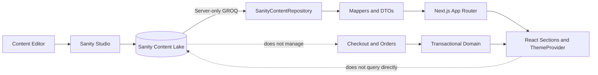

O CMS não deve armazenar dados pessoais, pedidos, pagamentos, estoque de vagas nem credenciais de integrações. O domínio transacional continua sendo a autoridade para esses dados. O `package` no Sanity representa a oferta editorial; uma referência estável (`commerceProductId`) permite que o backend encontre o produto/preço autorizado antes de criar o checkout.

### 6.3 Arquitetura alvo

O `ThemeProvider` atual é um Client Component e usa `TourRepository` em memória. Ele não é um local apropriado para consultar o Sanity. A integração introduz uma fronteira server-side: a página obtém o modelo de conteúdo, o serializa como props e o provider apenas administra interação visual no cliente.

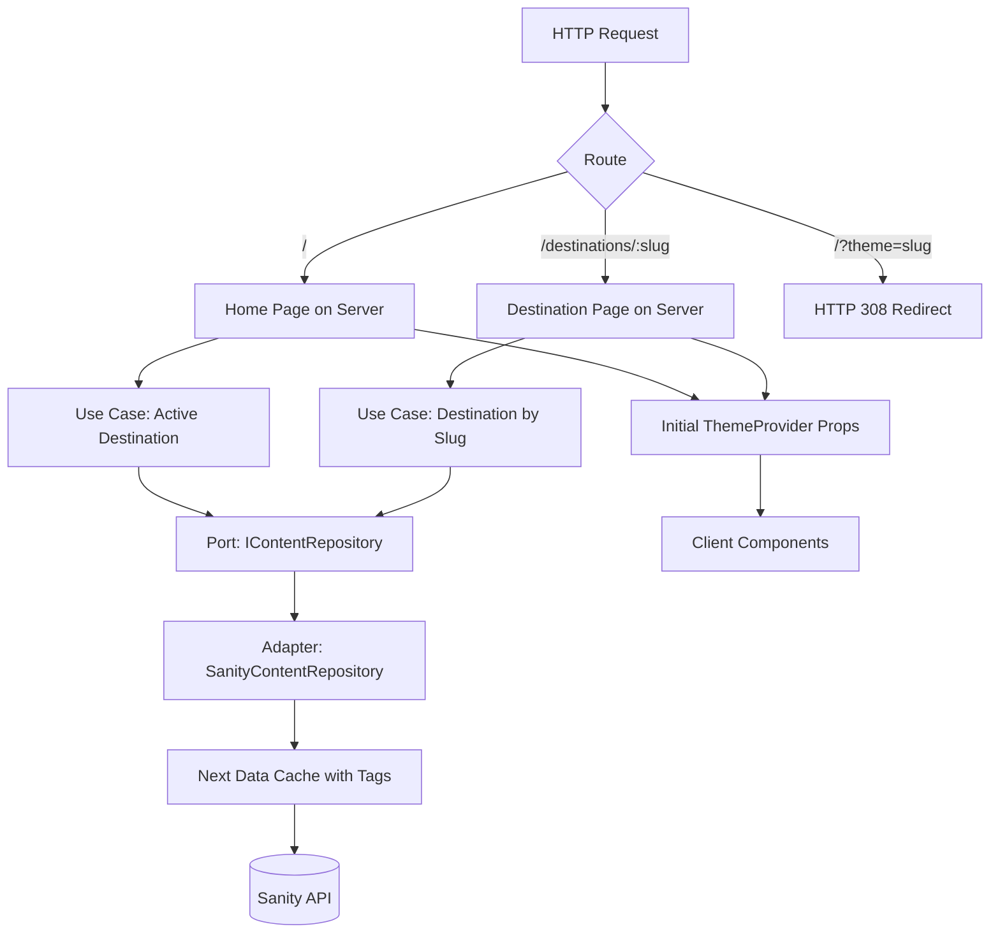

**Nota de implementação:** caso a adoção dos casos de uso seja excessiva para a primeira entrega, o repositório Sanity pode inicialmente ser chamado por um serviço server-only. Ainda assim, a interface e os mappers devem permanecer fora de `components/` e nenhum componente cliente deve fazer `fetch` direto ao Sanity.

---

## 7. Modelo de Conteúdo Completo

### 7.1 Tipos de documento

| Tipo | Finalidade | Publicação |
| --- | --- | --- |
| `siteSettings` | Singleton com destino ativo, contatos, rodapé e navegação global. | Um documento publicado. |
| `homePage` | Singleton que controla composição, visibilidade, ordem e textos das seções compartilhadas da home. | Um documento publicado. |
| `destination` | Conteúdo, tema, mídia, logística e SEO de um local. | Publicável de forma independente. |
| `package` | Oferta exibida no site, unitária ou anual. | Referencia destinos e o produto transacional. |
| `instructor` | Perfil reaproveitável de instrutores. | Referenciado por destinos. |
| `partner` | Perfil reaproveitável de parceiros e apoios. | Referenciado por destinos. |
| `testimonial`, `service`, `safetyProcedure`, `visitedLocation` | Conteúdo reutilizável de seções institucionais. | Referenciado por `homePage` e/ou `destination`. |

Nomes de schemas, tipos, campos, arquivos, símbolos e valores de enumeração devem ser em inglês e camelCase. Os exemplos de código deste RFC também usam rótulos em inglês; a localização da interface do Studio deve ser tratada fora do schema, quando necessária. A nomenclatura canônica é `siteSettings`, `package`, `instructor` e `partner`.

### 7.2 Relações, cardinalidade e ciclo de publicação

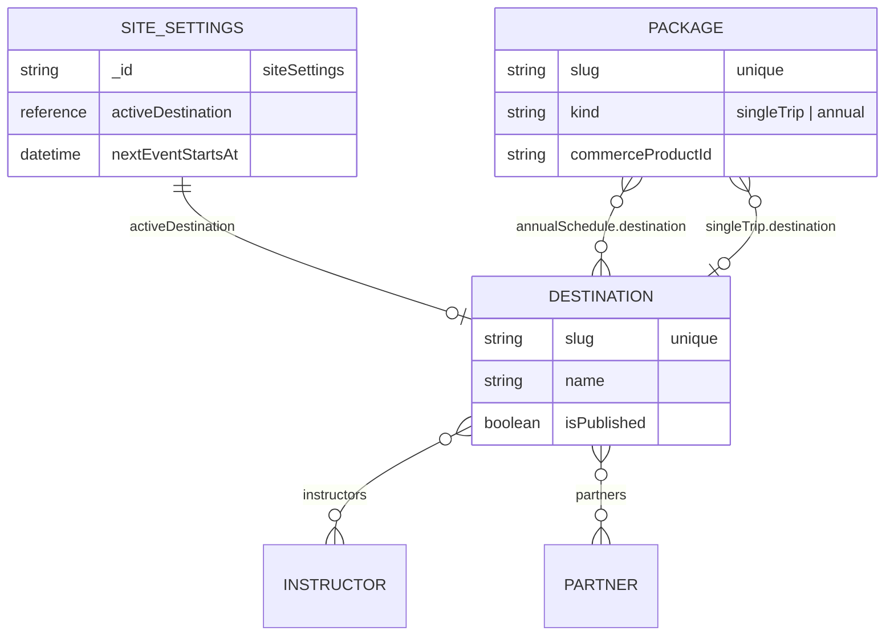

Uma referência não garante que o documento referenciado esteja publicado. As queries públicas precisam filtrar explicitamente `defined(activeDestination->slug.current)` e `activeDestination->isPublished == true`; da mesma forma, devem ignorar instrutores, parceiros e pacotes não publicados. O Studio deve orientar o editor a publicar dependências antes da configuração global.

### 7.3 Campos e regras transversais

- Todo documento deve ter `title`/`name`, `slug` quando possuir URL pública e preview configurado no Studio.
- `slug.current` deve ser único por tipo e imutável após uma URL ser divulgada. Mudanças exigem redirect explícito, não quebra silenciosa de SEO.
- Datas de eventos devem ser `datetime` com fuso (`America/Sao_Paulo`) e não texto livre. Um campo auxiliar de texto pode ser usado somente quando for necessária uma chamada editorial diferente da data formatada.
- Valores monetários devem ser inteiros em centavos (`priceInCents`) e moeda ISO 4217 (`BRL`). A apresentação deve usar `Intl.NumberFormat`.
- Textos ricos devem usar Portable Text quando houver necessidade real de links, listas ou ênfase. Texto simples continua `text`/`string`; evitar blocos ricos para rótulos curtos.
- Imagens obrigatórias devem ter `alt` obrigatório. O alt descreve a imagem; título/caption é opcional e editorial.
- Campos de URL devem ter protocolo `https` validado, exceto quando um requisito justificar explicitamente outro protocolo.
- A ordem de arrays relevantes deve ser definida pelo editor e preservada pela query; não depender da ordem interna de referências.

### 7.4 Schema de `package`

O schema abaixo fecha uma lacuna da proposta inicial: a seção de pacotes é dinâmica, mas não havia uma definição de documento para ela nem uma fronteira com o checkout.

```typescript
// sanity/schemaTypes/package.ts
export default {
  name: 'package',
  title: 'Package',
  type: 'document',
  fields: [
    { name: 'name', title: 'Name', type: 'string', validation: (Rule: any) => Rule.required() },
    {
      name: 'slug', title: 'Slug', type: 'slug', options: { source: 'name' },
      validation: (Rule: any) => Rule.required(),
    },
    {
      name: 'kind', title: 'Type', type: 'string', initialValue: 'singleTrip',
      options: { list: [
        { title: 'Single Trip', value: 'singleTrip' },
        { title: 'Annual Membership', value: 'annual' },
      ], layout: 'radio' },
      validation: (Rule: any) => Rule.required(),
    },
    { name: 'summary', title: 'Summary', type: 'text', rows: 3, validation: (Rule: any) => Rule.required() },
    { name: 'description', title: 'Detailed Description', type: 'array', of: [{ type: 'block' }] },
    { name: 'badge', title: 'Badge', type: 'string' },
    { name: 'isFeatured', title: 'Feature Offer', type: 'boolean', initialValue: false },
    { name: 'coverImage', title: 'Cover Image', type: 'image', options: { hotspot: true } },
    {
      name: 'includedItems', title: 'Included Items', type: 'array',
      of: [{ type: 'object', fields: [
        { name: 'iconKey', title: 'Icon Key', type: 'string' },
        { name: 'title', title: 'Title', type: 'string', validation: (Rule: any) => Rule.required() },
        { name: 'description', title: 'Description', type: 'string' },
      ] }],
    },
    {
      name: 'cta', title: 'Call to Action', type: 'object',
      fields: [
        { name: 'label', title: 'Label', type: 'string', validation: (Rule: any) => Rule.required() },
        { name: 'whatsAppMessage', title: 'WhatsApp Message Template', type: 'text', rows: 3 },
      ],
    },
    { name: 'termsUrl', title: 'Terms URL', type: 'url' },
    { name: 'cancellationPolicy', title: 'Cancellation Policy', type: 'text', rows: 3 },
    { name: 'eligibility', title: 'Eligibility Requirements', type: 'array', of: [{ type: 'string' }] },
    { name: 'isQuotation', title: 'Price on Request', type: 'boolean', initialValue: false },
    {
      name: 'priceInCents', title: 'Price in Cents', type: 'number',
      hidden: ({ parent }: any) => parent?.isQuotation,
      validation: (Rule: any) => Rule.integer().positive().custom((value: number, context: any) =>
        context.parent?.isQuotation || typeof value === 'number' ? true : 'Enter a price.'),
    },
    { name: 'currency', title: 'Currency', type: 'string', initialValue: 'BRL', readOnly: true },
    {
      name: 'commerceProductId', title: 'Checkout Product ID', type: 'string',
      validation: (Rule: any) => Rule.required(),
    },
    {
      name: 'singleTripDestination', title: 'Single-Trip Destination', type: 'reference',
      to: [{ type: 'destination' }], hidden: ({ parent }: any) => parent?.kind !== 'singleTrip',
    },
    {
      name: 'annualSchedule', title: 'Annual Schedule', type: 'array',
      hidden: ({ parent }: any) => parent?.kind !== 'annual',
      of: [{ type: 'object', fields: [
        { name: 'startsAt', title: 'Starts At', type: 'datetime', validation: (Rule: any) => Rule.required() },
        { name: 'endsAt', title: 'Ends At', type: 'datetime' },
        { name: 'label', title: 'Display Label', type: 'string' },
        { name: 'description', title: 'Description', type: 'text', rows: 2 },
        { name: 'status', title: 'Status', type: 'string', options: { list: ['planned', 'confirmed', 'completed', 'cancelled'] }, initialValue: 'planned' },
        { name: 'image', title: 'Image Override', type: 'image', options: { hotspot: true } },
        { name: 'destination', title: 'Destination', type: 'reference', to: [{ type: 'destination' }], validation: (Rule: any) => Rule.required() },
      ] }],
    },
  ],
  validation: (Rule: any) => [
    Rule.custom((doc: any) => {
      if (doc?.kind === 'annual' && !doc?.annualSchedule?.length) return 'An annual package requires at least one trip.';
      if (doc?.kind === 'singleTrip' && !doc?.singleTripDestination) return 'A single-trip package requires a destination.';
      return true;
    }),
  ],
};
```

Na implementação, substitua `any` pelos tipos exportados pelo pacote do Sanity. O trecho é deliberadamente ilustrativo: as validações definitivas devem ser testadas no Studio com o SDK/versão escolhida.

### 7.4.1 Cadastro detalhado do pacote anual

O pacote anual não é uma seção, uma página especial nem uma configuração da home. Ele é um único documento `package` com `kind: 'annual'`, renderizado junto aos demais cards de **Pacotes de Escalada**. Essa decisão garante que preço, CTA, destaque, disponibilidade editorial e regras comerciais estejam no mesmo modelo para qualquer oferta.

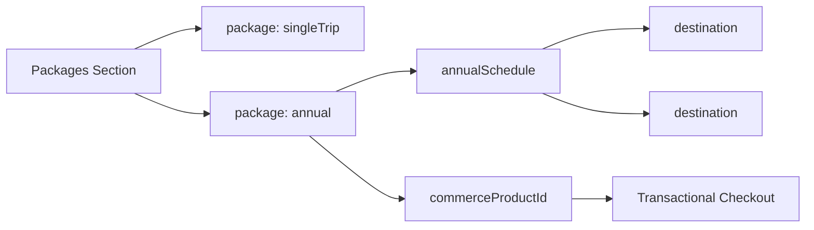

#### Campos obrigatórios para `kind: 'annual'`

| Grupo | Campos | Regra |
| --- | --- | --- |
| Identificação | `name`, `slug`, `summary`, `description`, `coverImage`, `badge` | `name`, `slug` e `summary` são obrigatórios. A descrição detalhada explica o que é a assinatura; não deve duplicar a agenda. |
| Exibição no card | `isFeatured`, `badge`, `includedItems`, `cta.label` | O card anual segue o mesmo componente dos demais. `isFeatured` controla apenas a ênfase visual. |
| Conversão | `commerceProductId`, `isQuotation`, `priceInCents`, `currency`, `cta.whatsAppMessage` | O produto transacional é obrigatório. Se `isQuotation` for falso, preço e moeda são obrigatórios. O checkout sempre revalida preço e disponibilidade. |
| Agenda anual | `annualSchedule[]` | Obrigatória, com pelo menos uma etapa, em ordem cronológica e com destinos referenciados publicados. |
| Cada etapa da agenda | `startsAt`, `endsAt`, `label`, `description`, `status`, `destination`, `image` | `startsAt` e `destination` são obrigatórios. `label` é texto editorial; destino e datas são a fonte factual. `image` só substitui a imagem do destino para aquela edição. |
| Inclusões e termos | `includedItems`, termos/URL de política, condições de cancelamento e elegibilidade | Devem ser exibidos no detalhe/modal do pacote. A regra aplicável no checkout é a autoridade final. |

#### Regras de validação do pacote anual

1. `annualSchedule` deve ter datas em ordem crescente, sem etapas com início duplicado.
2. `endsAt`, quando preenchido, deve ser posterior a `startsAt`.
3. Uma etapa com `status: 'cancelled'` continua no histórico, mas não pode ser apresentada como próxima saída.
4. Cada referência `destination` deve estar publicada antes da publicação do pacote anual.
5. Um destino pode ocorrer em mais de uma etapa; a repetição é válida quando refletir o calendário real.
6. Campos de vaga, estoque, autorização de pagamento e preço efetivo não pertencem ao Sanity. O CMS pode apresentar texto comercial, mas o checkout consulta a fonte transacional usando `commerceProductId`.
7. A home seleciona quais pacotes aparecem por referências ordenadas em `homePage.packagesSection.packageRefs`; não deve duplicar campos do pacote dentro da seção.

#### Exibição esperada na seção Pacotes de Escalada

O card anual mostra nome, badge, resumo, preço ou “sob consulta”, benefícios principais e CTA. Ao abrir o detalhe do pacote, o visitante vê a descrição completa, as inclusões, condições e a agenda anual ordenada. Cada item da agenda mostra data, rótulo, destino, status e link para `/destinations/[slug]`. Assim, o anual é rico em conteúdo sem criar uma segunda seção no site.

### 7.5 Ajustes ao schema de `destination`

Além do schema existente, incluir os seguintes campos:

| Campo | Tipo | Motivo |
| --- | --- | --- |
| `isPublished` | `boolean` | Permite retirar um destino das queries públicas sem apagar histórico. |
| `eventStatus` | `planned \| active \| archived` | Dá contexto editorial; o destino padrão ainda é decidido pelo singleton. |
| `hero.ctaLabel` e `hero.ctaHref` | `string` e `string` | Torna CTA do Hero editável, com whitelist de âncoras/rotas internas. |
| `logistics.schedule` | objeto com horários, notas e duração | Corresponde ao atual `ThemeConfig.logistics.schedule`. |
| `logistics.groupSize`, `included`, `notIncluded`, `requirements` | objeto/arrays | Necessário para a seção de serviços e para o detalhe da saída. |
| `activities` | array | Corresponde à seção de atividades e remove conteúdo remanescente do código. |
| `gallery.images[].image` | `image` com `hotspot: true` | Permite recorte responsivo no `next/image`. |
| `seo.noIndex` | `boolean` | Evita indexar destinos futuros/rascunhos, quando aplicável. |

As cores devem ser validadas como HEX (`#RGB`, `#RRGGBB`, com alfa opcional quando necessário). `heroOverlay` merece um campo próprio de cor com transparência ou dois campos (`overlayColor`, `overlayOpacity`); aceitar qualquer string CSS dificulta validação e pode introduzir valores inválidos.

### 7.6 Cobertura integral de conteúdo e composição da página

O schema `destination` cobre apenas conteúdo contextual do local. Ele **não** é suficiente para tornar o portal inteiramente editável: há conteúdo institucional, comercial e de navegação que não pertence a um destino. Para cobrir todas as seções, o CMS terá três níveis de conteúdo:

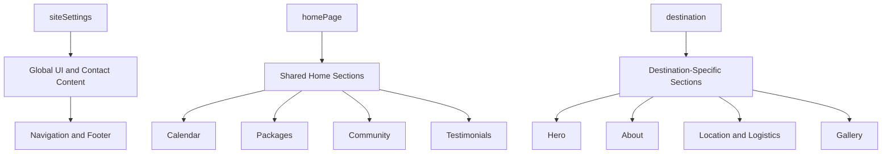

#### `siteSettings`: conteúdo global e identidade institucional

Além de `activeDestination` e contatos, `siteSettings` deve incluir:

- `brand`: nome, texto de apoio, logo, logo alternativa, favicon e URLs sociais;
- `navigation`: rótulo do menu, itens ordenados, ícones, âncoras/URLs, grupos e visibilidade por breakpoint;
- `footer`: título, texto institucional, grupos de links, rótulos de contatos, texto legal, certificações, logos e CTA;
- `contactInfo`: WhatsApp, e-mail, Instagram e templates de mensagem para CTAs (sem dados pessoais);
- `uiLabels`: rótulos transversais como “Saiba mais”, “Ver no mapa”, “Falar no WhatsApp”, “Em breve”, estados vazios e mensagens dos modais de lista de espera;
- `consent`: textos, links de política, categorias e versão do banner de cookies. A lógica de consentimento e os scripts permitidos permanecem no código.

`uiLabels` não é uma forma de tornar qualquer código configurável; ele se limita a textos reutilizados. Componentes devem possuir fallback de tradução seguro para rótulos obrigatórios.

#### `homePage`: conteúdo comercial e institucional compartilhado

Criar o singleton `homePage`, que é a composição editorial da página inicial. Cada seção tem `enabled`, `anchorId`, `navigationLabel` quando aplicável, título, subtítulo/descrição, CTA e os campos específicos abaixo. A ordem vem de `sectionOrder`; o frontend aceita somente tipos de seção previamente implementados.

| Seção exibida no portal | Fonte CMS | Campos editoriais mínimos |
| --- | --- | --- |
| **Home** | `homePage` + `siteSettings` + `destination` ativo | `sectionOrder`, seções habilitadas, navegação, metadados, composição do destino ativo e Hero (eyebrow, title, highlightedTitlePart, subtitle, description, media, overlay, CTAs e facts labels). |
| **Sobre nós** | `destination.content.about` | title, description, highlights, infoBox, image, caption e labels de endereço. |
| **Nunca Escalou?** | `destination.beginnerSection` | title, description, highlights, closingMessage, CTA e template de mensagem. |
| **Próximas Fronteiras** | `homePage.calendarSection` | title, description, emptyState, `events`, rótulo de destino secreto, CTA e texto de vagas. |
| **Pacotes de Escalada** | `homePage.packagesSection` + documentos `package` | title, description, labels de preço/indisponibilidade, CTA, `packageRefs` ordenadas e referências de pacotes. Pacotes `singleTrip` e `annual` são cards do mesmo grid; o anual usa sua própria agenda e benefícios. |
| **Tudo incluso nas nossas aventuras** | `homePage.includedServicesSection` + documentos `service` | title, highlightedText, description, service cards, promise title/text, checklist e CTA. |
| **Programação e Logística** | `destination.scheduleSection` e `destination.logistics` | title, labels, corporate CTA, schedule, meeting point, notes e tips. |
| **Como será o seu dia** | `destination.timelineSection` e `destination.timeline` | title, description, eventos ordenados e ícones. |
| **Galeria de Experiências** | `destination.gallerySection` e `destination.gallery` | title, description, filtros, imagens, captions e emptyState. |
| **Segurança em Primeiro Lugar** | `homePage.safetySection` + `destination.safetySection` | title, description, protocolos globais, seguro e complementos específicos do local. |
| **Equipamentos para a sua aventura** | `homePage.safetySection.equipment` + `destination.safetySection.equipmentOverrides` | title, description, lista de itens, labels de obrigatório/fornecido, CTA e observações por destino. |
| **Nossa Comunidade** | `homePage.communitySection` + `instructor`, `partner`, `safetyProcedure`, `visitedLocation` | title, texto de destaque, tabs, labels, estatísticas, filtros e referências exibidas. |
| **Como Chegar** | `destination.locationSection` e `destination.locationDetails` | title, descrição, labels, instruções, avisos, CTA de mapa e texto de acessibilidade. |
| **Depoimentos** | `homePage.testimonialsSection` + `testimonial` | title, description, depoimentos, labels de nível e CTA. |
| **Footer** | `siteSettings.footer` | todo o texto, links, certificações, contatos, CTAs e texto legal. |
| `Navigation`, `WaitlistModal` e `CookieBanner` | `siteSettings.navigation`, `siteSettings.uiLabels` e `siteSettings.consent` | rótulos, mensagens, CTAs, links legais e textos de consentimento; a lógica de navegação, formulário e consentimento continua no código. |

Para evitar conteúdo “escondido” no código, os textos de títulos, descrições, badges, CTAs, estados vazios, labels, notas e mensagens pré-preenchidas devem vir do respectivo documento CMS. Valores como IDs de âncora, variantes visuais e nomes de componentes continuam controlados pelo código.

#### Contrato de composição

```typescript
// src/core/entities/HomePageContent.ts
export interface HomePageContent {
  sectionOrder: HomeSectionKey[];
  calendarSection: CalendarSectionContent;
  packagesSection: PackagesSectionContent;
  includedServicesSection: IncludedServicesSectionContent;
  safetySection: SafetySectionContent;
  communitySection: CommunitySectionContent;
  testimonialsSection: TestimonialsSectionContent;
}

export type HomeSectionKey =
  | 'hero'
  | 'about'
  | 'beginner'
  | 'calendar'
  | 'packages'
  | 'includedServices'
  | 'schedule'
  | 'timeline'
  | 'gallery'
  | 'safety'
  | 'community'
  | 'location'
  | 'testimonials';
```

`sectionOrder` é validado contra esta allowlist e não pode conter duplicatas. Para uma seção específica de destino, `homePage` controla posição e visibilidade, enquanto `destination` fornece o conteúdo contextual. Isso permite trocar a ordem de seções sem permitir que o CMS injete componentes arbitrários.

#### Novos documentos reutilizáveis

| Documento | Conteúdo que deixa de ser estático |
| --- | --- |
| `testimonial` | nome público, foto, texto, data, experiência, avaliação, consentimento de publicação e ordem. |
| `safetyProcedure` | título, descrição, detalhes, ícone, mídia e ordem. |
| `visitedLocation` | nome, slug, região, imagem, descrição, status e referência opcional a `destination`. |
| `service` | título, descrição, ícone, condição/nota e ordem para serviços incluídos. |

Não publicar depoimentos sem consentimento registrado. Informações de contatos de instrutores e parceiros devem ser modeladas com visibilidade explícita (`public`, `contactOnly`, `hidden`) para evitar exposição acidental.

#### Requisitos de implementação por seção

1. Cada componente de seção recebe um view model/props do CMS; ele não deve importar textos de `constants.ts`, `community-data.ts` ou arrays locais.
2. A página monta as seções usando `sectionOrder` e `enabled`; se um tipo obrigatório estiver ausente ou inválido, registra erro e usa um fallback de apresentação documentado.
3. O schema marca como obrigatórios os campos necessários para renderização e usa limites de array apropriados; por exemplo, `highlights` de 1 a 6, `benefits` de 1 a 8 e `testimonials` de 1 a 12 na home.
4. Ícones são selecionados por uma allowlist de chaves (`iconKey`), não por componente, HTML ou SVG arbitrário enviado pelo CMS.
5. Imagens, vídeos, links externos e CTAs passam pelas mesmas validações de URL, `alt` e segurança definidas neste RFC.

---

## 8. Contratos, Queries e Mapeamento

### 8.1 Portas de leitura

```typescript
// src/core/repositories/IContentRepository.ts
export interface IContentRepository {
  getActiveSite(): Promise<ActiveSiteContent | null>;
  getHomePage(): Promise<HomePageContent | null>;
  getDestinationBySlug(slug: string): Promise<DestinationContent | null>;
  listDestinations(): Promise<DestinationSummary[]>;
  listPublishedPackages(): Promise<PackageContent[]>;
}
```

`SanityContentRepository`, em `src/infrastructure/repositories/`, implementa esta porta. O contrato não deve retornar tipos gerados pelo Sanity, `SanityDocument`, nem URLs de asset em formato intermediário. Ele deve retornar DTOs próprios, validados e normalizados.

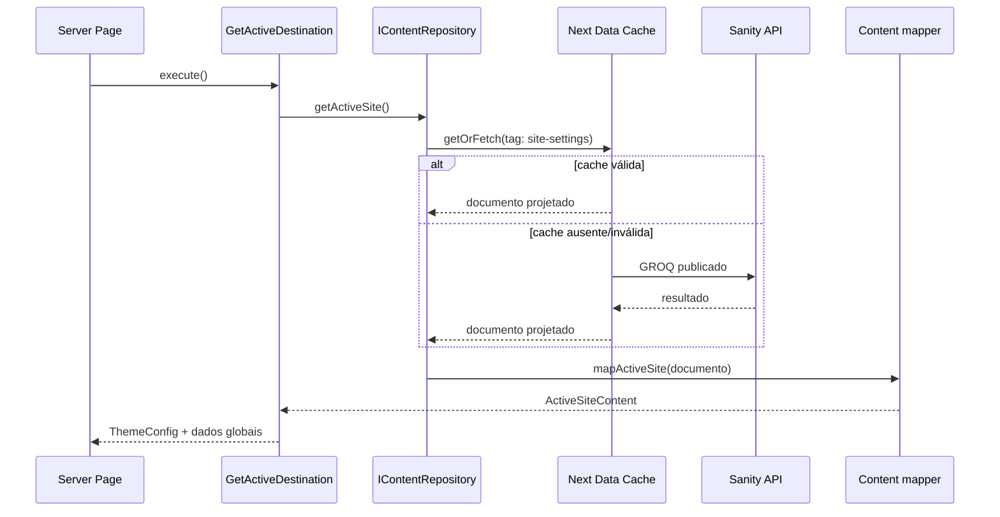

### 8.2 Regras de query GROQ

1. Sempre consultar conteúdo publicado: `_type == 'destination' && !(_id in path('drafts.**'))`.
2. Projetar somente os campos necessários para a página; não usar `...` em documentos públicos.
3. Resolver referências na mesma query apenas quando fizer sentido para a página. Para cards/listas, usar projections resumidas.
4. Ordenar explicitamente: por exemplo, `order(name asc)` em listas e `order(startsAt asc)` na agenda anual.
5. Retornar `_id` e `_updatedAt` apenas quando forem necessários para tag/diagnóstico; nunca enviar dados administrativos ao cliente.

Exemplo resumido para a home:

```groq
*[_type == "siteSettings" && _id == "siteSettings" && !(_id in path("drafts.**"))][0] {
  nextEventStartsAt,
  contactInfo,
  footerSettings,
  "activeDestination": activeDestination->[
    _type == "destination" && isPublished == true && !(_id in path("drafts.**"))
  ] {
    "id": slug.current, name, visualConfig, locationDetails, content,
    beginnerSection, safetySection, timeline, logistics, activities,
    gallery { categories, images[] { "src": image.asset->url, alt, title, category } },
    seo { title, description, keywords, "ogImage": ogImage.asset->url, noIndex }
  }
}
```

Se `activeDestination` não resolver para um destino publicado, o repositório deve devolver `null`, registrar o erro de configuração e a página deve renderizar o fallback estático durante a migração ou uma tela operacional segura depois dela. Não deve tentar escolher outro destino arbitrariamente.

### 8.3 Mapeamento e compatibilidade

| Sanity | Modelo de UI atual | Regra |
| --- | --- | --- |
| `slug.current` | `ThemeConfig.id` | Obrigatório e estável. |
| `locationDetails.displayName` | `location.name` | Usar `name` do destino se ausente. |
| `content` | `ThemeConfig.content` | Defaults explícitos somente para campos opcionais. |
| `visualConfig` | `ThemeConfig.visual` | Rejeitar paleta incompleta; nunca interpolar CSS não validado. |
| `beginnerSection` | `ThemeConfig.beginner` | Renomear no mapper, não no componente. |
| `timeline` | `ThemeConfig.timeline` | Preservar a ordem editorial. |
| `community` | `ThemeConfig.community` | Converter referências em IDs/DTOs conforme o componente precisar. |

O mapper é também o lugar para compatibilidade temporária com os arquivos em `src/themes/configs/`. O fallback deve ser observado em logs e ter data de remoção; não pode virar uma segunda fonte de verdade permanente.

---

## 9. Renderização, Cache e Revalidação

### 9.1 Estratégia

- Usar renderização server-side com Data Cache do Next.js para conteúdo do Sanity. O objetivo é HTML rápido e SEO consistente, não uma consulta de CMS a cada interação do cliente.
- Encapsular cada consulta em `unstable_cache` (ou na abstração estável equivalente disponível na versão de Next adotada), com tags semânticas.
- Usar `revalidate` como rede de segurança, por exemplo 1 hora. O webhook é o mecanismo de invalidação de baixa latência; o TTL impede cache indefinido caso o webhook falhe.
- Definir `useCdn: false` para leituras que precisam refletir publicação logo após a invalidação. Se a estratégia escolhida usar o CDN público, documentar e aceitar a pequena janela de propagação.

Tags mínimas:

| Alteração | Tags a invalidar |
| --- | --- |
| `siteSettings` | `site-settings`, `destination:active`, `packages` |
| `homePage` | `home-page` |
| `destination` | `destination:{slug}`, `destinations`, e `destination:active` se for o ativo |
| `package` | `packages`, `package:{slug}` |
| `instructor`, `partner`, `testimonial`, `service`, `safetyProcedure` ou `visitedLocation` | `home-page` e `destination:{slug}` para cada destino referenciador; alternativamente `destinations` enquanto o volume for pequeno |

### 9.2 Fluxo de publicação

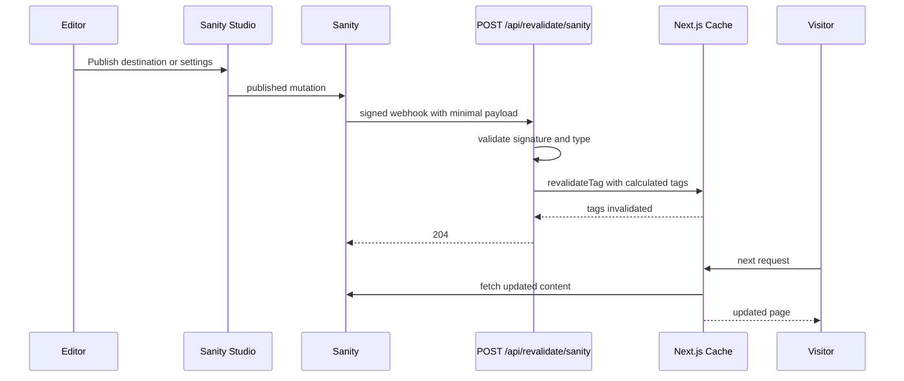

### 9.3 Endpoint de revalidação

O endpoint aceita apenas `POST`, exige `Authorization: Bearer <SANITY_WEBHOOK_SECRET>` com comparação segura, e não recebe uma tag arbitrária fornecida pelo cliente. Ele calcula tags a partir de uma allowlist de `_type` e `slug` validados.

```typescript
// src/app/api/revalidate/sanity/route.ts (pseudocódigo)
export async function POST(request: Request) {
  assertBearerSecret(request.headers.get('authorization'));
  const event = await parseAndValidateWebhookPayload(request);
  const tags = tagsFor(event); // allowlist: siteSettings, destination, package, instructor, partner
  for (const tag of tags) revalidateTag(tag);
  return new Response(null, { status: 204 });
}
```

O handler deve retornar `401` para segredo ausente/inválido, `400` para payload malformado ou tipo não permitido e `204` somente após invalidar as tags. Não registrar o header de autorização, tokens ou o documento completo. A URL do webhook deve ser HTTPS e protegida também no provedor de hospedagem quando houver recurso de proteção adicional.

### 9.4 Variáveis de ambiente

| Variável | Exposição | Uso |
| --- | --- | --- |
| `NEXT_PUBLIC_SANITY_PROJECT_ID` | Pública | Identificador do projeto. |
| `NEXT_PUBLIC_SANITY_DATASET` | Pública | Dataset público de produção. |
| `SANITY_API_READ_TOKEN` | Somente servidor | Leitura de dataset privado ou preview; nunca prefixar com `NEXT_PUBLIC_`. |
| `SANITY_WEBHOOK_SECRET` | Somente servidor | Validação do webhook. |
| `SANITY_STUDIO_PREVIEW_SECRET` | Somente servidor | Sessão de preview, se habilitada. |

Preview/draft mode é opcional na primeira fase. Se for habilitado, ele deve exigir autenticação do Studio, usar token de leitura no servidor, declarar `no-store` para a visualização e nunca ser indexável por buscadores.

---

## 10. Rotas, SEO e Experiência de Navegação

### 10.1 Convenção de URL

| Caso | URL canônica | Comportamento |
| --- | --- | --- |
| Evento/destino ativo | `/` | Renderiza `activeDestination`. |
| Destino específico | `/destinations/[slug]` | Renderiza o destino publicado solicitado. |
| Parâmetro legado depreciado | `/?theme=[slug]` | Redireciona com HTTP 308 para `/destinations/[slug]` apenas durante a janela de depreciação; não deve ser usado por código novo. |
| Slug inexistente/não publicado | `/destinations/[slug]` | `notFound()`, sem vazar informação de drafts. |

Cada página de destino deve gerar metadata no servidor a partir do DTO (`title`, `description`, canonical, Open Graph e `robots`). Alterar `document.title` no `ThemeProvider` é insuficiente para rastreadores e compartilhamentos. A home mantém um canonical em `/`; destinos arquivados podem usar `noindex` conforme a estratégia comercial, sem deixar de ser acessíveis para clientes com links antigos.

### 10.2 Depreciação de `theme`

`theme` é um detalhe de implementação do mecanismo estático atual e não representa corretamente o recurso de domínio (`destination`). Portanto, ele está **depreciado**.

1. **A partir da entrega CMS:** nenhuma URL, link interno, API, componente ou novo teste pode criar ou depender de `?theme=`.
2. **Compatibilidade temporária:** requisições existentes para `/?theme=[slug]` recebem redirect permanente (`308`) para `/destinations/[slug]`. O redirect preserva apenas parâmetros permitidos de campanha, como `utm_*`; `theme` é removido.
3. **Plano de depreciação:** antes do cutover, abrir uma tarefa de remoção com responsável, data de revisão, inventário de links/campanhas e dashboard de redirects. O plano deve incluir comunicação aos responsáveis por links externos e atualização de materiais próprios (navegação, e-mails, anúncios, QR codes e documentação).
4. **Critério de saída:** na revisão acordada, remover o redirect somente quando não houver dependência interna e o tráfego legado estiver dentro do limite aprovado por produto. Se o critério não for atendido, manter a compatibilidade e agendar nova revisão; não remover apenas pelo decurso de tempo.
5. **Remoção:** após a aprovação do critério de saída, remover o redirect, `getThemeFromUrl`, a escrita de `xperience-theme` no `localStorage`, testes associados e qualquer dependência de `theme` no `ThemeProvider`. URLs com o parâmetro passam a renderizar a home sem considerar seu valor.

O destino ativo nunca é escolhido por `theme`; ele é determinado por `siteSettings.activeDestination`. A seleção explícita de um destino acontece exclusivamente pela rota `/destinations/[slug]`.

### 10.3 Estados de falha

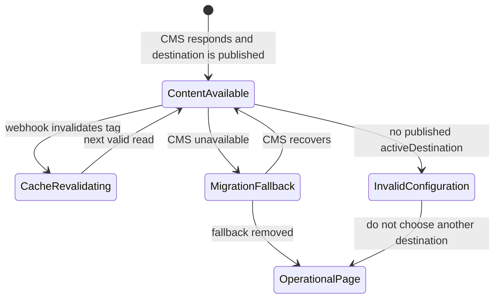

Durante a migração, `pedraBellaTheme` pode funcionar como fallback explícito e monitorado. Após o cutover, a preferência é uma página operacional amigável e alertada, pois exibir uma oferta antiga como se fosse atual pode induzir o visitante ao erro.

---

## 11. Segurança, Governança e Operação Editorial

### 11.1 Papéis no Studio

| Papel | Permissões esperadas |
| --- | --- |
| Administrador técnico | Configura schemas, webhooks, tokens, usuários e todas as publicações. |
| Gestor de conteúdo | Cria/edita/publica destinos, pacotes e configurações gerais; não acessa tokens. |
| Editor | Cria e edita rascunhos, sem publicar nem mudar o destino ativo. |
| Revisor | Consulta conteúdo e previews; sem mutação. |

O destino ativo é uma alteração de alto impacto. O Studio deve apresentar uma mensagem de confirmação com o nome do destino e a data do evento. Sempre que possível, usar histórico de revisões do Sanity e um processo editorial de revisão antes da publicação.

### 11.2 Proteções de conteúdo

- Sanitizar e restringir links renderizados de Portable Text; permitir apenas `https`, `mailto`, `tel` e rotas internas aprovadas.
- Não aceitar HTML arbitrário vindo do CMS.
- Validar limites de quantidade para galerias, highlights e agenda, evitando payloads excessivos e páginas degradadas.
- Configurar `next/image` para o domínio de CDN do Sanity e transformar imagens com largura/qualidade adequadas; não usar a URL original em todos os contextos.
- Definir política de retenção para mídias não referenciadas antes de apagá-las. Destinos históricos devem poder manter seu acervo.

### 11.3 Observabilidade

Registrar métricas e eventos estruturados para: sucesso/falha de query, uso de fallback, latência do CMS, falha de mapeamento/validação, webhook recebido/rejeitado, tags invalidadas e configuração ativa inválida. Alertas devem existir, no mínimo, para falhas contínuas de webhook e para home sem destino ativo válido.

---

## 12. Migração, Rollout e Reversão

### 12.1 Etapas

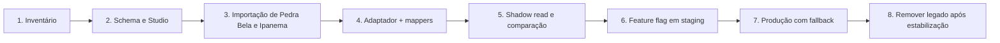

1. **Inventário:** mapear cada campo de `src/themes/configs/*`, `src/lib/constants.ts`, `src/lib/community-data.ts` e cada string/array em seções React para um campo Sanity, uma fonte transacional ou uma decisão de remoção. Nenhum dado deve ser perdido por omissão.
2. **Schema e Studio:** criar schemas, previews, grupos de campos e validações; configurar dataset e papéis.
3. **Importação:** cadastrar Pedra Bela e Fazenda Ipanema, incluindo assets, alt text, SEO e paletas. Conferir manualmente contra as páginas atuais.
4. **Adaptador:** implementar porta, cliente server-only, queries, mappers, cache e testes unitários. Os temas estáticos permanecem apenas como fallback temporário.
5. **Shadow read:** em ambiente de staging, buscar CMS e legado em paralelo, comparar IDs e campos obrigatórios nos logs sem alterar a página pública.
6. **Feature flag:** habilitar `CMS_CONTENT_ENABLED` em staging e depois em produção. A flag controla a fonte de leitura, não a criação de pedidos.
7. **Cutover:** publicar `siteSettings` apontando ao destino correto, habilitar webhook e monitorar cache, erros e métricas de página.
8. **Limpeza:** após a aprovação do plano de depreciação de `theme`, remover `TourRepository` em memória como origem de temas, `?theme=`, `getThemeFromUrl`, `xperience-theme` e os configs estáticos que já estiverem totalmente migrados.

### 12.2 Critério de reversão

Enquanto a flag estiver presente, uma reversão consiste em desligar `CMS_CONTENT_ENABLED` e retornar ao fallback estático previamente verificado. Ela deve ser usada para indisponibilidade ou erro de mapeamento que afete a home. Alterações de conteúdo equivocadas devem, preferencialmente, ser revertidas no Sanity e revalidadas via webhook, preservando o código de produção.

### 12.3 Matriz de migração

| Fonte atual | Destino | Dono após cutover |
| --- | --- | --- |
| `src/themes/configs/pedra-bela.ts` | documento `destination/pedra-bela` | Sanity |
| `src/themes/configs/fazenda-ipanema.ts` | documento `destination/fazenda-ipanema` | Sanity |
| seleção do primeiro tour ativo em `ThemeProvider` | `siteSettings.activeDestination` | Sanity |
| temas construídos de `TourRepository` | `SanityContentRepository` + mapper | Infrastructure |
| preço/autorização de checkout | serviço transacional existente | Backend da aplicação |

---

## 13. Plano de Testes e Critérios de Aceite

### 13.1 Testes mínimos

- **Schemas:** validações impedem publicação de destino sem slug, paleta obrigatória, imagens sem alt quando exigido e pacote anual sem agenda.
- **Mapper:** documento completo, campos opcionais ausentes, URLs inválidas, referência não resolvida e paleta incompleta.
- **Repositório:** queries filtram drafts, ordenam agenda e retornam `null` para configuração ativa inválida.
- **Webhook:** segredo válido/inválido, payload malformado, tipos permitidos, tags calculadas e ausência de tag arbitrária.
- **Páginas:** `/`, `/destinations/[slug]`, `notFound`, metadata e fallback sob falha simulada do CMS.
- **E2E:** publicar uma mudança de Hero em staging, acionar webhook e confirmar que a página atualiza sem novo deploy; selecionar outro destino ativo e validar cor, conteúdo, CTA e checkout correspondente.
- **Não regressão:** fluxos de carrinho, checkout, lead e autenticação continuam funcionando sem depender de dados de rascunho do CMS.

### 13.2 Critérios de aceite

1. Marcos consegue publicar uma mudança de texto, imagem, data, pacote, seção, navegação, rodapé ou destino ativo sem alterar código ou disparar deploy.
2. A home reflete a alteração publicada após a invalidação de cache; o tempo objetivo ponta a ponta é de até 60 segundos em condições normais.
3. Nenhum token de escrita/leitura privada ou segredo de webhook é carregado no bundle do cliente.
4. Destinos publicados possuem páginas canônicas, metadata de servidor e imagens com texto alternativo.
5. O checkout valida produto, preço e disponibilidade por sua fonte transacional, mesmo que o conteúdo editorial do pacote tenha sido alterado no CMS.
6. Erros do CMS não resultam na escolha silenciosa de um destino diferente.
7. A documentação operacional inclui como publicar, trocar o destino ativo, verificar o webhook e reverter uma alteração.

---

## 14. Riscos, Alternativas e Questões em Aberto

| Tema | Risco/alternativa | Decisão ou ação necessária |
| --- | --- | --- |
| Estrutura de eventos | Um `destination` descreve o local, mas várias edições podem ocorrer nele. | Para o escopo atual bimestral, o singleton aponta ao destino. Se houver necessidade de histórico, vagas ou preços por edição, introduzir `event` como documento separado antes do lançamento. |
| Dados de pacote versus venda | Preço no CMS pode divergir do checkout. | `commerceProductId` é obrigatório e o backend é a autoridade final. Definir qual serviço fornece preço e disponibilidade reais. |
| Conteúdo 100% dinâmico | Algumas seções atuais podem conter lógica, não apenas conteúdo. | Fazer inventário por componente; CMS parametriza conteúdo, não código executável nem layout arbitrário. |
| Preview | Aumenta complexidade e requer autenticação. | Adiar para fase 2, salvo necessidade editorial imediata. |
| Localização de Sanity Studio | Pode viver no repositório ou em projeto separado. | Decidir responsável de deploy e domínio do Studio antes da implementação. |
| Inconsistência de nomes | Uma mistura de português e inglês em identificadores fragmenta a API. | Adotar `siteSettings`, `package`, `instructor` e `partner` no código novo; criar migração explícita se já houver dados. |

### 14.1 Evolução futura: entidade `event`

Caso um destino volte a receber eventos com datas, preços, capacidade ou textos distintos, o modelo deve evoluir para `event` em vez de duplicar campos no destino:

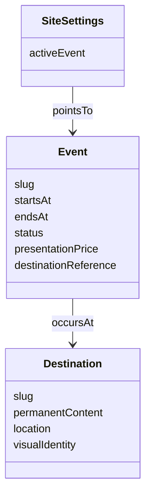

Isso separa o que é permanente (o lugar) do que é temporal (a edição da experiência). Não é obrigatório para a primeira entrega, mas evita uma migração difícil se o calendário crescer.

---

## 15. Próxima Decisão Requerida

Antes de iniciar a implementação, validar com produto e operação:

1. O pacote e checkout já possuem uma fonte transacional para `commerceProductId`, preço e vagas, ou ela ainda precisa ser definida?
2. Um mesmo destino poderá ter eventos recorrentes com conteúdo/data diferentes? Se sim, iniciar diretamente com o documento `event`.
3. O Studio será hospedado junto deste repositório ou em um projeto Sanity separado, e quem terá permissão de publicação?

Com essas definições, a primeira entrega pode ser fatiada em: Studio e schemas, importação dos dois destinos, repositório/mappers server-side, revalidação e cutover controlado.
