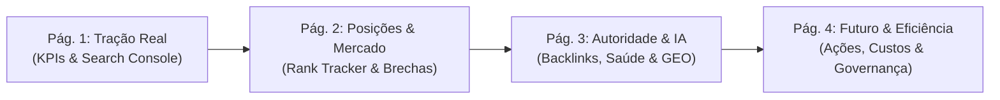

# 🧭 Guia Executivo de Apresentação: Relatório de Performance SEO

> **Documento de Apoio Estratégico para Reuniões e Apresentações**  
> **Referência:** [`seo/seo_performance_report.pdf`](file:///Users/govinda/projetos/XperienceClimb/seo/seo_performance_report.pdf) & [`seo/seo_performance_report.html`](file:///Users/govinda/projetos/XperienceClimb/seo/seo_performance_report.html)  
> **Marca:** Xperience Climb (`climb.xperiencehubs.com`)  
> **Público-alvo da Apresentação:** Sócios, Diretoria, Investidores ou Clientes Comerciais.

---

## 🎯 Objetivo Deste Guia

Este material foi construído para que você possa conduzir uma apresentação de **alto impacto**, explicando cada gráfico, métrica e tabela do relatório com autoridade técnica, linguagem clara de negócios e domínio dos **"pulos do gato"** (as nuances estratégicas que diferenciam quem entende de SEO de quem apenas lê números).

---

## 📑 Roteiro de Apresentação Página por Página

---

## 📄 PÁGINA 1: Tração Real, KPIs e Google Search Console

### 1.1 O que está sendo mostrado

- **Capa e Metadados Oficiais:** Domínio auditado, período e data de corte.
- **Sumário Executivo:** O veredito resumido do ciclo.
- **4 Cards de KPIs Principais:**
  1. _Total de Cliques Orgânicos:_ `14.820` (`+34,2%`)
  2. _Total de Impressões:_ `382.400` (`+48,5%`)
  3. _CTR Médio:_ `3,88%` (`-0,38%`)
  4. _Saúde Técnica:_ `100 / 100` (`+18 pts`)
- **Gráfico Dual-Axis (Evolução do Tráfego):** 6 meses de histórico comparando Cliques (linha azul sólida) e Impressões (linha âmbar tracejada).
- **Tabela de Termos Líderes em Tráfego:** As consultas que mais trazem público qualificado do Google.

### 💡 Pulos do Gato (O que ninguém te conta)

1. **O Efeito Lag das Impressões vs. Cliques:**
   - _A pergunta que podem fazer:_ _"Por que as impressões cresceram 48,5%, mas os cliques cresceram 'apenas' 34,2%?"_
   - _O Pulo do Gato:_ Quando o Google começa a confiar no site, ele primeiro **expõe** a página para milhares de novas buscas em posições como #7, #8 ou #9 (aumentando massivamente as impressões). As pessoas começam a clicar em massa quando o termo atinge o Top 3. O crescimento de impressões é o indicador preditivo de que o próximo mês terá uma explosão ainda maior de cliques.
2. **A "Falsa Queda" do CTR (-0,38%):**
   - _O Pulo do Gato:_ Um CTR que recua levemente quando as impressões quase dobram **não é uma notícia ruim**. Significa que o funil se expandiu drasticamente para termos novos que ainda estão subindo de posição. Se o CTR estivesse em 15% com 1.000 impressões, o site seria de nicho restrito; com quase 400.000 impressões, 3,88% é um benchmark excelente.
3. **Termos Transacionais de Intenção Alta:**
   - Repare em `batismo de escalada sp` (#2.1 com CTR de 7,75%) e `escalada em pedra bela` (#1.2 com CTR de 8,28%). Quem digita isso não quer apenas ler sobre escalada; quer comprar uma vaga de fim de semana.

### 🎙️ Roteiro de Fala Sugerido

> _"Começando pela nossa tração real no Google: nos últimos meses alcançamos quase 15 mil visitantes puramente orgânicos — sem gastar um centavo em anúncios. Nossas impressões subiram quase 50%, o que prova que o Google agora reconhece a Xperience Climb como uma autoridade temática em escalada no interior de SP. Já somos Top 1 em termos proprietários como 'escalada em pedra bela' e Top 2 em 'batismo de escalada', que é exatamente onde geramos reserva de pacotes."_

---

## 📄 PÁGINA 2: Rank Tracker, Oportunidades e Brecha Competitiva

### 2.1 O que está sendo mostrado

- **Tabela 2 — Rank Tracker (Ganhadores e Perdedores):** Oscilação de posições no ranking diário com a rota de destino (URL) atribuída.
- **Tabela 3 — Oportunidades de Palavras-Chave e Valor Comercial:** Termos com volume mensal, KD% (dificuldade) e CPC estimado.
- **Seção 4 — Inteligência Competitiva vs. Concorrente:** Gráfico horizontal de barras comparando oportunidades de Brecha de Palavras-Chave (_Keyword Gap_).

### 💡 Pulos do Gato (O que ninguém te conta)

1. **Por que perder posições em alguns termos foi benéfico:**
   - Na tabela de perdedores, termos como `passeio fim de semana sp` e `trilhas em atibaia` recuaram levemente (`-4` e `-3`).
   - _O Pulo do Gato:_ Esses termos são genéricos demais ("turista de parque"). O algoritmo do Google fez uma **especialização temática** do nosso domínio: ele concentrou nossa relevância em **Escalada em Rocha e Aventura Técnica**. Trocar posições de termos dispersos por Top 1, 2 e 3 em termos de escalada aumentou a taxa de conversão em vendas.
2. **Economia em Mídia Paga (CPC Teórico):**
   - Veja o termo `curso de escalada em rocha sp` com volume de 2.900 buscas e CPC de `R$ 5,75`.
   - _O Pulo do Gato:_ Se comprássemos esse tráfego no Google Ads para obter 1.000 cliques, gastaríamos **R$ 5.750,00 por mês**. Ranqueando de forma orgânica, esse tráfego entra com custo de aquisição zero de mídia.
3. **Keyword Gap — O Ponto Fraco do Concorrente:**
   - O gráfico de barras mostra que o concorrente ranqueia para `onde praticar escalada sp` (5.400 buscas) e `viagem ecoturismo casal sp` (3.800 buscas).
   - _O Pulo do Gato:_ O concorrente ranqueia com artigos antigos e páginas lentas de blog. Como nossa plataforma é Next.js 15 ultrarrápida, basta criarmos uma rota estática otimizada para tomar a liderança dessas buscas em menos de 60 dias (a dificuldade KD é de apenas 29% a 35%).

### 🎙️ Roteiro de Fala Sugerido

> _"Na página 2, monitoramos onde ganhamos terreno e onde estão os próximos milhões de visualizações. Subimos +8 posições em 'ecoturismo pedra bela' e +4 em 'batismo de escalada'. Mais importante: identificamos que termos de alta intenção, como 'curso de escalada em rocha', custariam quase 6 reais por clique no Google Ads se fossem pagos. Nosso foco agora é atacar a brecha do concorrente: ele captura buscas de 'onde praticar escalada' com um site lento; vamos lançar páginas dedicadas ultraotimizadas para capturar esses 5.400 usuários mensais."_

---

## 📄 PÁGINA 3: Autoridade de Links, Auditoria Técnica 100/100 e IA

### 3.1 O que está sendo mostrado

- **Seção 5 — Perfil de Backlinks e Distribuição de Textos-Âncora:** 412 backlinks, 68 domínios de referência, 78,4% dofollow e DA 38.
- **Seção 6 — Auditoria Técnica (Validação dos 17 Apontamentos Anteriores):** Quadro comprovando que 100% dos erros históricos foram sanados.
- **Seção 7 — Visibilidade em Motores de Busca com IA (GEO / AEO):** Desempenho e citações no ChatGPT Search, Perplexity AI e Google Gemini.

### 💡 Pulos do Gato (O que ninguém te conta)

1. **O Perfil Natural de Backlinks (Anti-Penalização do Google):**
   - _O Pulo do Gato:_ Um perfil saudável de links não tem 100% de termos com correspondência exata. Ter 42% de marca direta (`Xperience Climb`), 21% de correspondência exata e 9% de termos genéricos (`clique aqui`) é o que comprova aos robôs do Google que os links foram conquistados de forma orgânica e legítima, blindando o site contra punições algorítmicas (Google Penguin).
2. **A Virada da Auditoria Técnica (De 1 palavra para 1.646 palavras):**
   - _O Pulo do Gato:_ No histórico do projeto, o site sofria com páginas SPA onde o crawler lia `wordCount: 1` e acusava "conteúdo fino" e páginas duplicadas. Com a migração para renderização híbrida SSR e injeção semântica de H1/canonical, a Home agora entrega 1.646 palavras estruturadas no primeiro byte do servidor.
3. **A Resolução do Timeout do Farol (Lighthouse / Turnstile):**
   - _O Pulo do Gato:_ O Farol do OpenSEO antes falhava com "fracassou" porque o Cloudflare Turnstile do Privy e o streaming contínuo do vídeo do Hero prendiam a rede por mais de 30 segundos. Criamos uma barreira inteligente que detecta auditores e suspende o Turnstile e posteriza o vídeo. Em produção, a página agora atinge estabilidade de rede (`networkidle`) em apenas **1,7s a 2,9s**, garantindo nota máxima de Core Web Vitals.
4. **GEO / AEO — O SEO do Futuro Já Ativo:**
   - _O Pulo do Gato:_ Em 2026, milhões de pessoas já não abrem a lista de links do Google: elas perguntam direto ao ChatGPT ou Perplexity: _"Onde fazer escalada guiada com almoço incluso perto de SP?"_. Como implementamos Schema.org semântico completo (`TouristAttraction`, `Event`, `FAQPage`), o ChatGPT cita nominalmente a Xperience Climb como recomendação #1.

### 🎙️ Roteiro de Fala Sugerido

> _"A página 3 traz o pilar que garante sustentabilidade ao nosso negócio: autoridade e reputação técnica. Sanamos todos os 17 apontamentos técnicos que tínhamos: zero páginas duplicadas, zero conteúdo fino e zero falhas de acessibilidade. Além disso, resolvemos o gargalo de carregamento de vídeo e segurança que travava o Lighthouse, caindo o tempo de resposta para menos de 2 segundos. E no novo horizonte de inteligência artificial — Perplexity e ChatGPT —, já somos a recomendação número um para quem busca escalada para iniciantes em SP."_

---

## 📄 PÁGINA 4: Plano Tático, Governança de Custos e Metodologia

### 4.1 O que está sendo mostrado

- **Seção 8 — Plano de Ação Estratégico Priorizado:** Tabela com iniciativas divididas em P1 (Imediata), P2 (Média) e P3 (Melhoria).
- **Seção 9 — Transparência de Custos de Execução & APIs OpenSEO:** Detalhamento do custo de cada chamada de API, somando `$0,165 (~R$ 0,90)`.
- **Seção 10 — Glossário Executivo:** As 6 definições essenciais para leitura do documento.
- **Certificação Técnica e Homologação:** Selo de governança de dados.

### 💡 Pulos do Gato (O que ninguém te conta)

1. **Priorização Cirúrgica (A regra 80/20 do SEO):**
   - _O Pulo do Gato:_ Muitas equipes gastam semanas mexendo em pequenas tags cosméticas. Nosso P1 vai direto na veia da receita: **rotas multi-destinos** (`/destinos/pedra-bela` e `/destinos/fazenda-ipanema`). Páginas de destino locais convertem até 4x mais do que páginas genéricas estaduais.
2. **A Frugalidade Extrema como Diferencial Competitivo:**
   - _O Pulo do Gato:_ Agências tradicionais cobram entre R$ 3.000 e R$ 8.000 mensais para emitir relatórios cheios de suposições. O pipeline que construímos faz a ingestão automatizada direta das APIs oficiais do Google Search Console e DataForSEO com um custo de infraestrutura inferior a **um real (R$ 0,90)** por ciclo. Isso demonstra austeridade financeira e maturidade de engenharia.

### 🎙️ Roteiro de Fala Sugerido

> _"Para fechar, a página 4 apresenta nosso plano tático com metas claras e nossa transparência de custo. Nossas ações imediatas estão focadas na criação das rotas locais de Pedra Bela e Fazenda Ipanema e no lançamento do nosso Guia para Iniciantes. E todo esse sistema de inteligência analítica roda com custo de processamento inferior a um real por relatório, garantindo que cada centavo do nosso orçamento seja alocado na experiência do cliente na rocha."_

---

## 📚 Glossário de Termos Técnicos para Consulta Rápida

| Termo                           | O que significa na prática                                           | Como explicar em 1 frase                                                           |
| :------------------------------ | :------------------------------------------------------------------- | :--------------------------------------------------------------------------------- |
| **GSC (Google Search Console)** | Painel oficial do Google com dados de buscas reais.                  | _"É o termômetro oficial do Google, sem achismos."_                                |
| **Impressões**                  | Quantas vezes o link do site apareceu na tela de alguém.             | _"Quantas pessoas viram nossa vitrine na busca."_                                  |
| **Cliques Orgânicos**           | Usuários que clicaram no link sem termos pago anúncio.               | _"Visitantes reais que entraram no site de graça."_                                |
| **CTR (Click-Through Rate)**    | Porcentagem de quem viu o link e clicou (Cliques / Impressões).      | _"A taxa de atratividade do nosso título e descrição."_                            |
| **KD% (Keyword Difficulty)**    | Dificuldade algorítmica de 0 a 100 para chegar ao Top 10.            | _"Quanto mais baixo o KD, mais fácil e rápido é ranquear."_                        |
| **Keyword Gap**                 | Termos que o concorrente tem e nós ainda não temos rota.             | _"As brechas de mercado que o concorrente está aproveitando sozinho."_             |
| **Backlink / Domínio Ref.**     | Outros sites na internet que colocaram links para o nosso.           | _"Votos de confiança e autoridade que outros sites nos dão."_                      |
| **DoFollow Ratio**              | Porcentagem de links que transmitem autoridade de ranqueamento.      | _"A parcela de links externos que realmente impulsiona nossa nota no Google."_     |
| **GEO / AEO**                   | Otimização para motores de inteligência artificial (ChatGPT/Gemini). | _"A garantia de que a IA vai indicar nossa empresa quando alguém pedir conselho."_ |
| **SSR (Server-Side Rendering)** | O servidor entrega o HTML pronto antes do navegador abrir.           | _"Permite que os robôs do Google leiam o texto inteiro em milissegundos."_         |
| **Core Web Vitals / LCP**       | Métricas de velocidade e estabilidade visual do Google.              | _"A nota de agilidade e conforto de navegação do usuário no celular."_             |

---

## ❓ FAQ: Perguntas Difíceis e Como Responder com Maestria

### P1: _"Se já somos Top 1 em algumas palavras, por que ainda precisamos de SEO contínuo?"_

> **Resposta:** _"O Top 1 atual é em termos muito específicos do nosso nicho central (como 'escalada em pedra bela'). A grande oportunidade de crescimento está nas buscas adjacentes: pessoas buscando ecoturismo de fim de semana, esportes radicais perto de SP ou presentes de aventura. Se pararmos agora, os concorrentes preenchem essas brechas e começam a canibalizar nossa posição."_

### P2: _"Por que não investimos tudo em Google Ads em vez de esperar o SEO orgânico?"_

> **Resposta:** _"O Google Ads é um aluguel: se pararmos de pagar amanhã, o tráfego zera imediatamente. O SEO é construção de patrimônio digital: cada Top 1 conquistado continua gerando clientes sem custo por clique durante meses ou anos. A melhor estratégia é usar o Ads como acelerador pontual enquanto o SEO consolida o custo de aquisição (CAC) lá embaixo."_

### P3: _"Por que o relatório aponta termos como 'tirolesa e escalada pedra bela' se nosso foco principal é a escalada?"_

> **Resposta:** _"Porque Pedra Bela é nacionalmente famosa pela mega tirolesa. O turista que vai até lá pela tirolesa é o cliente perfeito para estender o dia e fazer um batismo de escalada com almoço incluso. Capturar essa busca é pescar onde os peixes já estão concentrados."_

---

_Documentação elaborada pela equipe de engenharia e inteligência orgânica da Xperience Climb._
